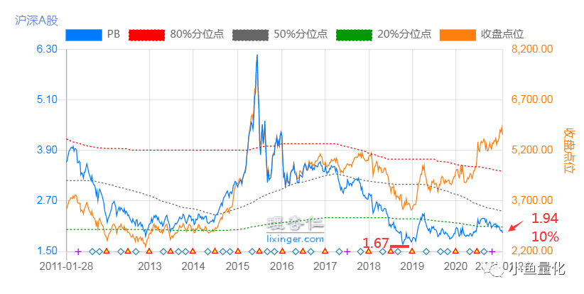

# 全市场估值

这个概念来自 ETF 拯救世界

E大采用的是等权估值，用理杏仁的沪深A正数等权来衡量一下。

https://www.lixinger.com/analytics/index/dashboard/value?source=all&series=all&metric-type=ew&granularity=y10&sort-name=pe_ttm.cv&sort-order=asc

小根据E大的一些公开文章和资料，对黄金坑和钻石坑进行了定义：

**黄金坑**

**全市场等权PB在2.2以下**；

2018底以来，全市场等权PB最高的有两个点，

- 一个是2019年4月达到了2.4
- 一个是2020年8月达到了2.3；

**钻石坑**

全市场等权PB在**1.85**以下；

现在全市场等权PB=1.94，距离2018年10月最低点的1.67，还有多少空间呢，（1.94-1.67）/1.94=14%.

# 2. 巴菲特指标

是股神巴菲特分析了美国80年上市的数据，总结的一个判断股市高位和低位的一个指标。

具体就是一国股市总市值与GDP总量的比值。

在我们国家，巴菲特指标和沪深300指数的走势是高度相关的，

[https://mmbiz.qpic.cn/mmbiz_png/HKuQ5gXlnBAy9RHGN20QraXJ5OWUZiatwS1hkZibSY3Pv2BlTtsaxj0k84swL9sUAltNjRNbx12fg06OWU28I8aw/640?wx_fmt=png&tp=webp&wxfrom=5&wx_lazy=1&wx_co=1](https://mmbiz.qpic.cn/mmbiz_png/HKuQ5gXlnBAy9RHGN20QraXJ5OWUZiatwS1hkZibSY3Pv2BlTtsaxj0k84swL9sUAltNjRNbx12fg06OWU28I8aw/640?wx_fmt=png&tp=webp&wxfrom=5&wx_lazy=1&wx_co=1)

（数据来源：乐咕乐咕网）

我们可以清楚地看到：

沪深300指数的历史低位对应着巴菲特指标的低位，而沪深300指数历史高位出现时，巴菲特指标也走高，两者相关性非常一致。

故横向比较相关具体国家巴菲特指标在历史不同时期的变化，就可以作为判定股票市场估值水平的一个重要参考指标。

一般来说，在我们国家巴菲特指标低于70%时代表低估可以大胆买入，巴菲特指标70%-90%可以正常持有；而如果巴菲特指标高于90%那就得当心了。

# 3. **股债利差**

股债利差出自美联储的相关研究，美联储证明过去多年数据，发现股票投资收益率与美国长期国债收益率之间存在显著的相关性。

【股债利差】可以简单的理解为股票的收益比国债高多少。

具体就是【股票的收益率】-【国债收益率】。

如果股票每年收益10%，10年期国债利率3%，大家都会去买股票。反过来，如果股票每年收益只有2%，那没人会买股票，全买国债。

所以当差值越大的时候，说明股票比国债收益更高，股票越值得买。

[https://mmbiz.qpic.cn/mmbiz_png/HKuQ5gXlnBAy9RHGN20QraXJ5OWUZiatwtS02X4EoCLhAnEM2pPz7Pww4TGv3ns5Os3wGvuKPuavkl6BCxEJiaOw/640?wx_fmt=png&tp=webp&wxfrom=5&wx_lazy=1&wx_co=1](https://mmbiz.qpic.cn/mmbiz_png/HKuQ5gXlnBAy9RHGN20QraXJ5OWUZiatwtS02X4EoCLhAnEM2pPz7Pww4TGv3ns5Os3wGvuKPuavkl6BCxEJiaOw/640?wx_fmt=png&tp=webp&wxfrom=5&wx_lazy=1&wx_co=1)

从上图，我们可以非常清晰地看到：

股债利差的数值与整体市场的走势有着非常明显的负相关关系，非常有力地印证了【股债利差越大，股票越值得买】的结论。

如果我们进一步计算出历史上每个交易日的股债利差值，然后和历史上的时间比，算出比历史上百分之多少的时间都大，就可以很好地判断市场的估值。比如，如果股债利差比历史上90%的时间都大，那就是股市非常便宜，非常值得买入的时机。

# 4. 全市场等权中位数PE/PB值（最重要）

我们对比全市场市盈率走势图（下面第一张图）和股票的走势图（下面第二张图）：

[https://mmbiz.qpic.cn/mmbiz_png/HKuQ5gXlnBAy9RHGN20QraXJ5OWUZiatwlsKFgqwVXzEUAnhlia0TsC0PrjzU3Vajiak98zxRs6gl2sS68US2m2tQ/640?wx_fmt=png&tp=webp&wxfrom=5&wx_lazy=1&wx_co=1](https://mmbiz.qpic.cn/mmbiz_png/HKuQ5gXlnBAy9RHGN20QraXJ5OWUZiatwlsKFgqwVXzEUAnhlia0TsC0PrjzU3Vajiak98zxRs6gl2sS68US2m2tQ/640?wx_fmt=png&tp=webp&wxfrom=5&wx_lazy=1&wx_co=1)

[https://mmbiz.qpic.cn/mmbiz_png/HKuQ5gXlnBAy9RHGN20QraXJ5OWUZiatwEJ88I7AKyt2OZ4N8SnsfTfOAHEY3HSfa2rn0DeQstOcdm2S5NsnXGw/640?wx_fmt=png&tp=webp&wxfrom=5&wx_lazy=1&wx_co=1](https://mmbiz.qpic.cn/mmbiz_png/HKuQ5gXlnBAy9RHGN20QraXJ5OWUZiatwEJ88I7AKyt2OZ4N8SnsfTfOAHEY3HSfa2rn0DeQstOcdm2S5NsnXGw/640?wx_fmt=png&tp=webp&wxfrom=5&wx_lazy=1&wx_co=1)

估值（市盈率）的底部，都是对应股价的底部。所以通过估值（看全市场等权中位数PE/PB），我们就能判断市场在高位还是低位。

一般来说，

当估值比历史上70%都便宜（即PE估值百分位小于30%）的时候属于低估，我们可以大胆买入，越低越买；

估值PE百分位水平介于30%-70%的时候继续持有；

高于70%的时候就属于高估选择卖出。

**为什么看全市场PE/PB值？**

用全市场的PE/PB对整个市场估值，最能准确反映全部市场的情况。

**为什么用“等权”而不是“加权”？**

A股中银行等金融股占了一多半的权重，导致估值失真，会让人误以为估值很便宜。

等权，就是所有股票权重一样，这样更能反映市场的真实情况。

**为什么用中位数？**

我们来看两组数据，

[https://mmbiz.qpic.cn/mmbiz_png/HKuQ5gXlnBAy9RHGN20QraXJ5OWUZiatwhy03Dwl8kTkleVMxVL5aicLb97mIibmlVGJ8HxRNrVgaWxmrkiaV5XRibA/640?wx_fmt=png&tp=webp&wxfrom=5&wx_lazy=1&wx_co=1](https://mmbiz.qpic.cn/mmbiz_png/HKuQ5gXlnBAy9RHGN20QraXJ5OWUZiatwhy03Dwl8kTkleVMxVL5aicLb97mIibmlVGJ8HxRNrVgaWxmrkiaV5XRibA/640?wx_fmt=png&tp=webp&wxfrom=5&wx_lazy=1&wx_co=1)

可以看到，

第一组数据的中位数是9，平均数是8，基本符合整体数据情况；

第二组数据的中位数仍然是9，但平均数约为78，全部数据中大部分都在10以内，但平均数却是78，很明显不符合真实情况。

平均数非常容易受到【极端值】的影响，导致其它数据【被平均】，进而无法反应市场的真实估值情况。

A股市场整体非常喜欢炒作，热门题材股/妖股动辄市盈率几千倍，几万倍，几十万倍，很容易平均掉其它低市盈率的股票，导致市场估值失真，所以中位数相对来说更能反映市场真实情况。

[https://mmbiz.qpic.cn/mmbiz_png/HKuQ5gXlnBAy9RHGN20QraXJ5OWUZiatwRSenFzmFy5HBCpjy3VjqtglsJJvt74xoluicKrMe1bvyhg2zjWIOBQQ/640?wx_fmt=png&tp=webp&wxfrom=5&wx_lazy=1&wx_co=1](https://mmbiz.qpic.cn/mmbiz_png/HKuQ5gXlnBAy9RHGN20QraXJ5OWUZiatwRSenFzmFy5HBCpjy3VjqtglsJJvt74xoluicKrMe1bvyhg2zjWIOBQQ/640?wx_fmt=png&tp=webp&wxfrom=5&wx_lazy=1&wx_co=1)

（数据来源：A股市盈率前十名/2020-3-24）

在具体的实操中，由于巴菲特指标范围过大，不够精细，所以最常用的是第三个即：市盈率、市净率。

不过，这里大家要注意，由于股票影响因素众多，没有哪个指标能绝对预测到最低点，只能预测到相对的底部。