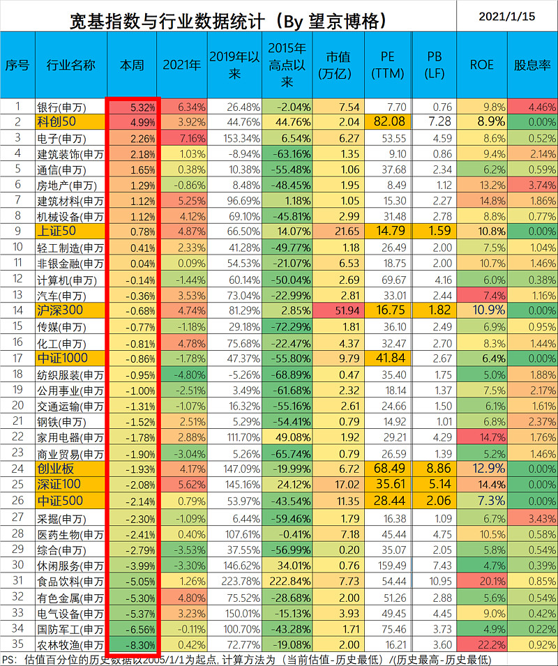

# 2.1 选择指数

# 1. 有哪些指数？

大陆

香港

美国

加拿大

选购基金

- 美国科技股基金
- 中国沪深指数基金                 招商深证100指数A(217016)
- 热门板块基金                         华夏能源革新股票(003834) 、 招商中证白酒指数分级(161725)
- 大盘股基金                              嘉实价值精选股票(005267)

# 2. 哪些指数是值得投资的？

### （一）如何选股

简单说，就是：**自己判断标准+参考雪球大v**

我的选股标准：

1. 商业模式的选择
   1. 行业要好，就是常说的赛道要好，要有长长的坡，厚厚的雪。
      - 这些有朝阳产业，比如医美未来市场空间巨大。
      - 或者永恒的行业，比如跟人类生命健康相关的医药（包括药械和服务）行业。
      - 或者起码50年100年不会轻易消亡的产业，比如白酒，我想50年后100年后，中国人还是会喝白酒
   2. 生意模式要好，最好轻资产，赚钱轻松，最好不要辛苦赚钱的
2. 业绩分析
   1. 月线要持续向上的，在股灾中抗跌的；
   2. 几个重要的财务指标筛选：
      1. 一是roe（据说是巴菲特最看重的一个指标），近五年不要低于20%，
      2. 二是利润增速，近五年不要低于20%，
      3. 三是，毛利率，近五年不要低于20%。以上三个越高越好
3. 公司管理层讲诚信，没有劣迹，有战略眼光，有人格魅力，有执行力，有远大抱负
4. 参考雪球大v分析个股。雪球很多乐于分享的大咖，他们自己分析的也好，转载的研报也好，有些分析得特别棒，有理有据，数据翔实，支撑有力。球友眼睛雪亮，结合评论和自己的几个判断标准，心里就基本有数了

按照此标准，就把a股四千多只股票大部分排除在外了，我们就在这里继续精挑细选，胜率已经大大提高

## 2.1 宽基指数基金

### **中证消费50指数！**

**1、指数名称：**中证消费50指数，简称CS消费50，代码：931139

**2、发布时间：**2019年3月20日

**3、指数基日：**2004年12月31日

**4、选股范围：**由沪深两市可选消费与主要消费（剔除汽车与汽车零部件、传媒子行业）中规模大、经营质量好的50只龙头公司股票组成

与中证消费龙头指数的区别是剔除汽车与汽车零部件、传媒子行业，更纯粹一些

成分股数量：50只

单只成分股权重：不超过15%

成分股市值：市值最大约2万亿，最小约45亿，平均市值约为**1509亿元**

**5、指数加权方法**

按照过去一年日均总市值、营业收入、ROE与毛利率四个指标排名，选取综合排名靠前的50只股票作为成分股

**6、前十大权重股及权重比例**

十大权重股中，既包括了贵州茅台、五粮液、泸州老窖等三大白酒龙头，也包括了美的集团、格力电器和海尔智家等三大家电龙头，还有伊利股份、中国中免、海天味业等消费细分领域龙头

**7、历史表现**

截止到10月30日，该指数近1年收益**40.33%**、近3年年化**22.10%**、近5年年化**25.88%**。从过往收益情况来看，无论短期，还是中长期都相当出色

该指数以2004年12月31日为基日，以1000点为基点。截止2020年11月5日收盘，收报23530点，盘中该指数还创出了历史最高点**23725点**！16年时间，累计涨幅超过**22倍**！

个人判断

整个中国的国力、社会地位等等逐步上升。参照美国的经验，国内的消费也会相应升级和消费金额变大。

这个指数是和国力成正比。 比较稳定。可以长期持有

## 2.2 行业指数基金

芯片ETF、

5GETF、

军工ETF、

证券ETF

凡是投资理财的人，一定想过十年十倍的好事

十年十倍，等于一块钱，十年变成十块钱。也等于一百万，十年变成一千万

折合成年化收益率，大概十年每年**26%**左右

要承认，这是很难达到的数字

因为你一年50%甚至100%都没用，要达到平均十年，每年26%才可以完成十年十倍

如果投资者投资的时间足够长，就算取不到26%年化收益的好成绩，长期**20%**，也是非常可观的

比如说，一代股神巴菲特，他50年投资的平均年化收益就在**20%**左右

前不久，老司基写过一篇文章《[无意中，发现一只年化20%的宝藏指数](https://xueqiu.com/7552001880/160950180)》，引起不少小伙伴关注，毕竟这样的好指数是不多的

今天，老司基又给大家挖到一个更牛的指数。它最近16年涨了**22倍**，最近5年的年化收益达到了惊人的**26%**！如此低调奢华的指数，不香么？

**近5年TA跑赢了99.7%的主动基金**

在揭晓这个指数名称之前，我们先来看看它妖娆性感的走势图：

最近5年，该指数从6500点左右一路向东北方向挺进，涨到了22500点上方，累计涨幅超过**246%**。最近5年的年化收益率达到**25.88%**，最近3年的年化收益率达到**22.1%**

年化收益26%，放眼全市场最优秀的主动基金经理，能取得这样成绩的也是凤毛麟角

老司基拉了一下业绩数据，看看最近5年最优秀的主动权益基金收益如何，这里选取的是普通股票型和偏股混合型基金两大类品种

**近5年年化收益超20%普通股票型基金TOP 20**（数据来源：同花顺ifinD,截至2020.10.30）

普通股票型基金中，只有两只基金最近5年的年化收益超过了26%，分别为冯明远的信达澳银新能源产业股票和萧楠的易方达消费行业股票基金

**近5年年化收益超20%偏股混合型基金TOP 20**（数据来源：同花顺ifinD,截至2020.10.30）

偏股混合型基金中，也只有5只基金的近5年年化收益超过了26%

现在全市场普通股票型和偏股混合型基金总数量大概2000只，最近5年年化收益超过26%的基金总共才7只，占比仅为**0.35%**！换句话说，这个神奇的指数在最近5年，跑赢了99.7%的主动基金

**TA是谁？**

看到这里，估计很多小伙伴都着急死了：老司基，你到底说的是哪个指数啊？

好了，正式揭晓答案，这个指数就是——

**消费行业值得长期投资**

这几年，A股市场公认的三大好赛道便是消费、医药和科技，而消费行业属于其中最稳定的一个行业，毕竟衣食住行都与我们的生活息息相关

东兴基金投资总监张旭在11月4日的一次在线分享活动中指出，从全球角度来看，美日等发达国家GDP组成中消费占比均超过了70%且保持较为稳定的状态，目前我国这一占比为54%左右，尚有30%以上的上升空间，大消费行业将迎来宏观层面的“戴维斯双击”，具有长期投资价值基础。中国巨大的消费纵深决定了消费升级是永恒的话题，消费板块高盈利能力及稳定性是投资消费行业内在根源

海外成熟市场经验显示，大消费行业是盛产牛股的摇篮。美国沃顿商学院杰里米·J·西格尔教授根据美股长达46年的数据，汇总出20家投资回报率最高的上市公司。这20家最佳公司主要出自两个产业：高知名度的消费品牌公司和大型制药企业。像我们耳熟能详的可口可乐、百事可乐绿箭、宝洁等均位列其中

目前跟踪中证消费50的指数基金包括：场内基金有515650富国中证消费50ETF；场外的普通指数型基金有009116东兴中证消费50指数A和009117东兴中证消费50指数C等

[中证白酒](https://xueqiu.com/S/SZ399997?from=status_stock_match)10年16倍，[中证消费](https://xueqiu.com/S/SH000932?from=status_stock_match)17年16倍，医药10年10倍，[500低波](https://xueqiu.com/S/SH512260?from=status_stock_match)10年10倍，哪怕是最臭的[上证50](https://xueqiu.com/S/SH000016?from=status_stock_match)今年上半年也涨了30%，恐怕90%人都没跑过吧！

# 3. 可投资基金清单

