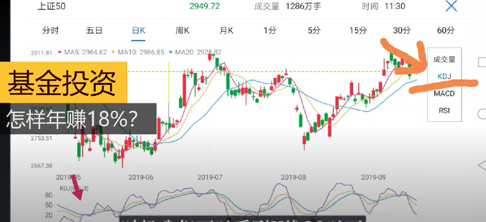
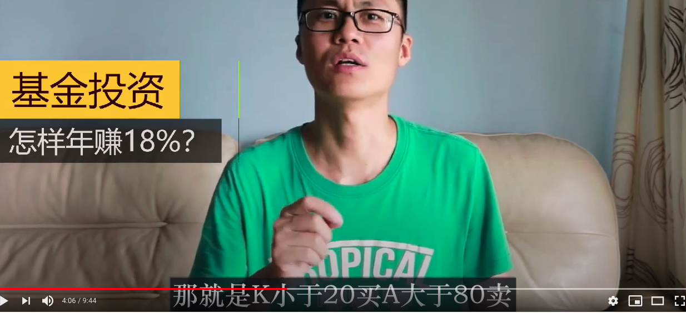

## 1. 基金价格标尺

### 1.1 价格标尺逻辑

1. 根据某些非常具体的参数，计算出某只基金的价格标尺

   1. 标尺范围 0-100

   2. 50，代表价格的正常值

   3. 数值越大，说明偏移正常值越多，下跌的概率越高

   4. 数值越小，说明偏移正常值越多，上涨的概率越高

      

2. 用这个标尺去测量该基金在各个特殊时期的长度

   1. 大涨
   2. 大跌
   3. 等等

3. 在后续该基金的买卖交易时，参考这个标尺来操作

4. 要做到每天定时自动化计算

### 1.2 标尺参照系

#### 1）全市场等权中位数PE/PB值

最重要的参考指标：【全市场等权中位数PE/PB值】

我们对比全市场市盈率走势图（下面第一张图）和股票的走势图（下面第二张图）：

估值（市盈率）的底部，都是对应股价的底部。所以通过估值（看全市场等权中位数PE/PB），我们就能判断市场在高位还是低位。

#### 2）DJK 线

####  3） 历史价位百分比

###  1.3 根据价格标尺的模拟操作

这一步，需要有代码帮忙长期计算目标基金的温度值

下图中的 x，就是准备每个月的平均投资额

比如，我一个月需要在鑫鑫成长基金投 2000，养老基金投5000- 那合起来就是 7000.

但是实际的投资和就是 温度对应下的比例 乘以 投资额。 

多出的钱，投入稳定的货币资金

这个方法，以不亏为首要目标，宁愿踏空，也不冒险

卖出买入的分界线，一般应该是自己来定。 现在是 40%-50%

这个卖出的风险点，可以参考最近一年内，该指数转折点的温度值的区间范围。

每一个指数，应该他的特性，应该都有一个特定的区间，是上下转换的。

根据基金温度来选择

# 1. 市盈率

一般用投资收回成本的时间来衡量股票的实际价值（即估值）。如果你投资的股票市值1亿，每年利润1000万，意味着你的投资10年后能收回成本，行话叫10倍估值。

专业名词叫市盈率。【市盈率（PE）=股票市值/利润】

市盈率为10，意味着收回投资成本需要10年，市盈率为5，意味着收回投资成本需要5年，市盈率为1，意味着收回投资成本只需要1年。

一般来说收回投资的时间是稳定的。比如，沪深300背后的公司一般平均10年能收回成本，这个平均值是相对稳定的，基本就是股市的成本价。

假设明年牛市来临，股价大涨一倍，市值变为了2亿，则20年后才能收回成本（20倍市盈率），比平均值一下子高一倍，这就明显贵了。

如果后年熊市来袭，股价直接跌了一倍，跌到了5000万，则我们的投资5年就可以收回成本（5倍市盈率），比市场平均值低一倍，明显便宜了。

**第一，用PE和PB判断估值准确吗？**

虽然在我们对A股20年，以及对美股将近40年的回溯中，单用PE或者PB两个因子做为量化投资个股能够取得一年70%多，三年80%多几率战胜市场的好成绩，但我个人认为，用市盈率或者市净率来投资个股，并非好的策略。净资产高的钢铁股，与亏损的京东如何放在一个范畴里估值？这是不合理的。所以，我反对只用pe和pb对个股估值。（btw，最好的投资策略，是三因子选股。估值、价格动量、盈利性三类各取一个因子组成模型，这里也用不到pepb，现金ROIC，自由现金流价格比等因子更好用。不展开说）

但是，放到全市场就完全不同了。对于整个市场来说，京东也好，钢铁也好，都只是一小撮。**用全市场的pe和pb，对整个市场估值，有助于理解我们现在是处在危险的悬崖边，还是安全的广场上。**毕竟，对于处在投资迷雾中的我们来说，24小时都是黑夜。整体贵还是便宜，是我们头上那盏救命灯。

# 收益率

