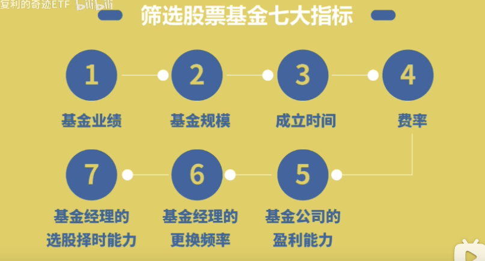
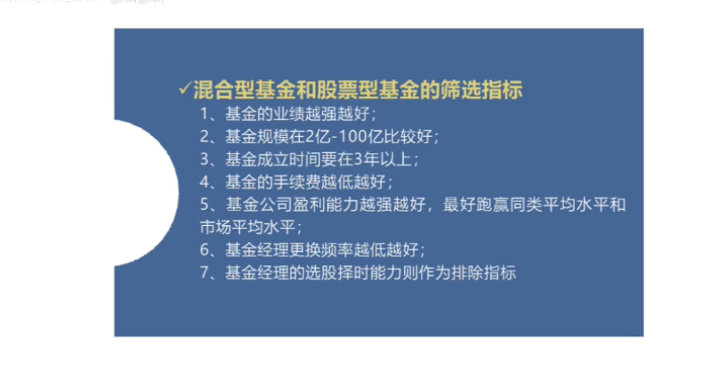
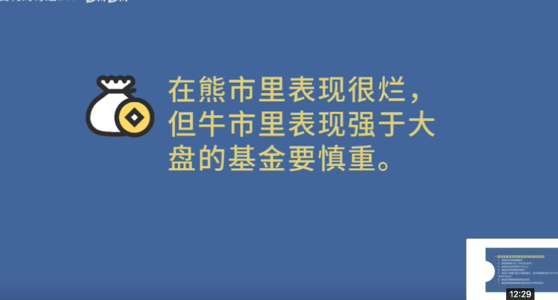
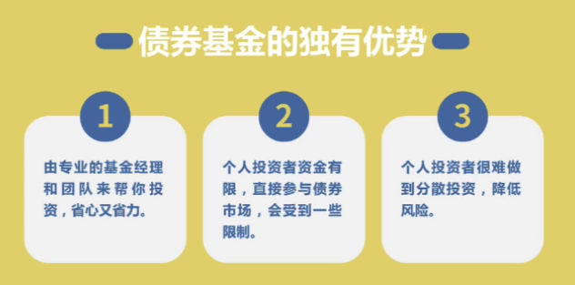
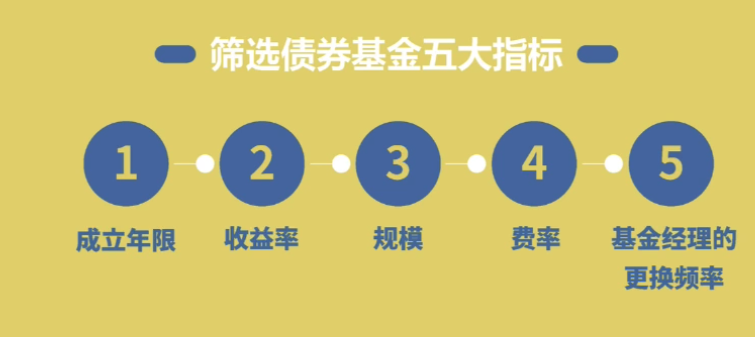
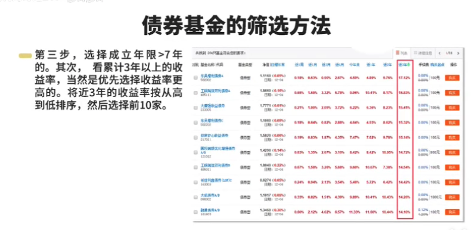
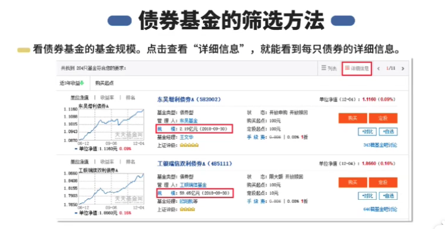
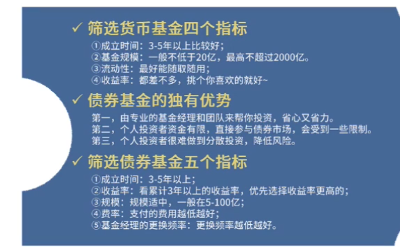
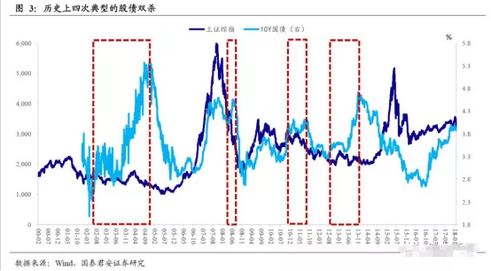

# 选债券基金

基金经理

- 从业 4 年以上
- 过往业绩在 15%以上

选明星基金公司，擅长领域的基金

最大回撤 30%以内

基金规模 5-50 亿

根据fof基金的购买基金来寻找基金

### 3.4 选股票基金

要强化去看熊市的表现

- 债券型基金：

购买国债企业债金融债，收取利息，收益稳定风险较低

收益 5-6%

用以规避风险

### 3.2 选债券基金

基金规模 5-100 亿比较好

# **02 什么是债券？**

债券本质上就是一个“借条”，在借条里清楚地写着我管你借了多少钱，利息是多少，约定在什么时候把本金还给你。

比如这张“联想债”，就是联想集团发行的面值为100元，票面利率为5.7%的债券，它代表的意思就是：你买一张“联想债”，将100元钱借给联想集团，那么它承诺以后每年将给你5.7元的利息，并在到期日2022年11月30日将本金100元一并归还给你。

国家跟你借钱，这个债券就叫作国债；

公司跟你借钱，就叫公司债；

地方政府借钱就叫地方债。

但是一般债券购买门槛很高，我们普通人只能通过债券基金来投资债券。债券基金就是筹集我们的钱，聘请专业人士来投资债券，为我们安稳地赚取收益。

一般来说，债券基金按照不同的分类标准可以分成不同的种类，

按照所投资标的划分，债基可分为

- “纯债基”

把所有的资金都用于投资债券，不买其它的，这类是“纯债基”。

- “一级债基”

有些债基把主要资金都投资债券，但还参与新股申购，这类是“一级债基”。

- “二级债基”

有些债基会拿其它20%的权重配置股票，以追求更高的收益，这类属于“二级债基”。

纯债券类基金一般收益5%左右，

一级债基相应高一点，二级债基的话更高一点，

比如，二级债基汇添富双利增强债券A，近3年收益22.29%,年收益6%左右，

西部利得祥盈债券A，近3年收益29.61%，年化收益9%。

易方达裕祥回报债券，近3年39.67%的收益，年化收益率更高达到12%，

从2004年初至2020年3月份，从1000点上涨到3000点，二级债基的平均年化收益率，大约是7.1%。非常诱人的回报啊！

除了二级债，一些量化对冲的基金也能实现类似债券的稳定收益。

## 量化对冲的基金

对冲策略的原理就是买入（A+B），卖出（A），无论市场涨跌都能赚B。

*举个例子，从沪深300支股票里面优中选优30支股票买入，这30支股票的收益=沪深300的平均收益+精选股票的超额收益。然后卖空沪深300， 相当于卖空沪深300的平均收益*。

如果股票涨了28%，沪深300大盘涨了20%。买入股票的收益28%，做空沪深300大盘亏了20%，总收益净赚8%。 如果股票跌了22%，沪深300大盘跌了30%。则买入股票亏了22%，做空大盘赚了30%，总收益依然净赚8%。

也就是无论大盘涨跌，都能赚8%，这就是对冲的好处。

我们来看一下采用对冲策略的绝对收益基金的业绩表现，

海富通阿尔法对冲混合，成立5年多，总收益57%，年化收益9%，收益稳健的向上增长。

中海积极收益混合，最近3年，总收益30%，年化收益9%左右，收益也是稳健增长。

这类基金着实让人看得眼睛发光，长期6%-8%的收益，还相对灵活的产品，整个市场非常稀缺，可谓是资产配置的核心灵魂。

## **03 怎么选出优质的债券类基金？**

债券类基金比较好选，主要就是看业绩，一般业绩不行就是不行。

**以业绩为核心，然后看风险、基金经理、基金公司、调研等因素就可以选出前20%的债券基金。**

我总结为以下六步：

**第一步，选业绩持续优秀的基金**

基金，业绩代表一切，稳健收益的基金更是如此，

巴菲特为何牛逼，因为业绩全球前几名。

业绩最能证明基金的优秀程度。

虽然过去业绩好并不代表未来业绩也一定好，但如果一只基金长期业绩优秀且稳定，那至少说明其综合能力中上等，未来业绩好的概率更大。

就好比，一个常年考班级前五名的同学，下次考进班级前五名的概率会更大，一般最差也不会跌出前30名。

目前业内常用的筛选基金业绩的方法是：“4433法则”。

这个方法由台湾大学的两位教授提出，以长期、中期、短期业绩排名作为筛选依据，认为同时符合4个筛选标准的基金，就是市场上的优质基金。

第一个4： 选择一年期业绩排名在同类基金中排前1/4的基金；

第二个4： 选择两年、三年、五年业绩排名在同类基金中排前1/4的基金；

第一个3： 选择近6个月业绩排名在同类基金中排前1/3的基金；

第二个3： 选择近3个月业绩排名在同类基金中排前1/3的基金。

“4433”法“兼顾长中短期业绩”，可以选出业绩持续优秀的基金。

**第二步：选风险低的基金**

基金的风险如何衡量，主要看下跌幅度。

A 基金赚7%收益，最大下跌5%。

B 基金赚7%收益，最大下跌15%。

虽然都是7%收益，但买A基金，下跌波动很小，可以一直拿住赚钱，

而买B基金，最大下跌幅度可以达到15%，很多人极有可能就彻底绝望拿不住，割肉白白亏损了。

我们很容易看出A基金比B基金风险低。

一般来说，偏债型基金

最大回撤在5%以内，很多人通常可以接受；

回撤5%-10%，人们会觉得损失惨重；

如果跌掉10%甚至更多的时候，大部分人就彻底崩溃，割肉出局白白亏损。

所以我们一般选最大回撤（从最高点下跌到最低点的幅度）在5%以内的基金。

**第三步：选从业3年以上的成熟基金经理**

投资行业水比较深，学校里的理论知识学得再好，量化模型做得再出色，没经历过牛熊历练，人性考验，还是很难成长为一名优秀的基金经理的。一般3年是一个牛熊轮回，所以要选从业3年以上，经历过牛熊历练的基金经理。

此外要看基金经理过往业绩，优秀且稳定的过往业绩是一个基金经理能力最有效的证明，一般偏债类基金经理过往业绩年化在6%以上为佳。

**第四步：选基金公司**

每个基金公司都有自己擅长的领域。

有的基金公司擅长绝对收益，比如：长安基金。

而有的基金公司则更擅长权益类投资，比如：兴全基金。

最好选该基金公司擅长领域的明星基金。

各个基金公司的风格和侧重都是什么呢？

**第五步：选基金成立时间，至少成立3年以上**

如果基金成立时间太短，说明运作还没有稳定，业绩没办法评估，很难区分这个基金的业绩是来自于运气还是实力。

**第六步，深入调研**

首先，我们一定要去观察这个基金的历史持仓投资记录。

比如，对于二级债基，你就要观察它的历史持仓记录里股票的配置比例到底是多少，持有的股票都是些什么类型的，与其宣传的理念是否一致，它的仓位偏好如何？仓位调整频率如何？

……

再就是要看这个基金经理的历史言论，

搜集基金经理发表的文章、接受采访以及公开发表的言论、基金公司的宣传材料等，查看他的投资逻辑、投资体系和实际持仓、实际操作是否符合！

最后，查看资深投资者、同行的评价。基金是个比较小的圈子，一般优秀的基金内行人普遍公认，明星基金更是如雷贯耳。

按照上面六步筛选基金，不敢保证一定能选出前5%的明星基金，但选出前20%的优秀基金还是可以的！

**04 实操步骤**

下面我用Wind以“挑选二级债券型基金（混合型/对冲型方法类似）”为例给大家说一下具体操作步骤：

**第1步**：打开wind金融终端-基金-基金研究；

**第2步**：点击【4433好基金】，我们可以看到目前市场上符合“4433”要求的基金共有472只，

（点击查看大图）

**第3步**：选择【债券类-二级债券基金】，设置【最大回撤近一年<5%】、【成立时间>3年】进一步筛选后还剩下28只基金，

（点击查看大图）

**第4步**：我们要找的基金是业绩持续优秀稳定的基金，不仅要牛市行情表现好，熊市依然要表现出色，因为2019年债市行情不佳，所以我们【按近1年收益率进行排名】，从上到下依次对比分析这剩下的28只基金，在基金前面的小框内【打√】，点击右上角【对比分析】，

（点击查看大图）

**第5步**：从28只基金中精选出表现相较更好的基金，将它们更详细的数据依次全部扒下来，6个月、1年、2年、3年、5年和总回报业绩，最大回撤等风险指标全部汇总到Excel表格中，建立一个基金池（混合型、对冲型基金按照同样的方法选出）

（点击查看大图）

**第6步**：详细分析基金经理，选出历史业绩6%以上，从业3年以上的基金经理。

**第7步**：在雪球、天天基金调研资深投资者，专业内行人对基金池中基金的评价，选出普遍公认的好基金。同时进一步阅读相关基金的年报、季报；基金经理发表的文章、接受采访以及公开发表的言论、基金公司的宣传材料等公开资料，验证基金业绩的持续性。

综合以上七步我们精选出一些优质基金，建立了一个基金组合，

**第8步**：按照【风险平价】策略分配每只基金的比例，回测其2017-6-24~2020-3-12期间的业绩。

从上图我们可以看到，该组合在过去两年半的时间里（穿越牛熊，2018年大跌、2019年大涨）将最大回撤控制在2%以内的同时取得了9.64%的年化回报率，非常让人满意的整体业绩表现啊！

**05 为什么我们要建立基金组合？**

因为没有任何投资产品是百分百正收益，没有任何风险！

单纯投资一支基金，容易被黑天鹅绝杀！

建立基金组合是为进一步降低基金的风险和波动！

大白话就是东方不亮西方亮，有些亏，有些赚，整体风险就会大大的降低。比如股票和债券往往是跷跷板，股票好的时候债券不好，债券好的时候股票不好。

这就是获得诺贝尔奖的资产组合理论：如果资产相关性弱，那么同时持有，就可以降低风险。

资产组合最核心的就是相关性弱，具体有精确的计算公式，我这里不展开了，下面这张计算草稿感兴趣的可以简单看看，不感兴趣的略过

组合的相关性如下：

**06 基金组合的配置比例是怎么确定的？**

主要是风险平价策略！

风险平价策略本质是风险高的比例低，风险低的比例高。

实现各类资产的风险贡献基本均衡。

比如股票的风险是4、商品的风险是3、黄金的风险是2，债券的风险是1；

通过给组合中股票、商品、黄金、债券分别配置12%、16%、24%、48%的比重。

这样我们就能使组合中股票（4*12%）、商品（3*16%）、黄金（2*24%）、债券（1*48%）四类资产的风险都相等。这就是风险平价策略。

我们的组合采用的就是风险平价策略，各只基金的风险权重占比都是相对均衡的，不会出现整个组合的风险主要集中于单独一两只基金的情况。

我们的模型会实时测算各只基金的风险暴露度，如果某一只基金风险上升，组合会将该基金的仓位调低，而风险较低的基金，仓位就会被调高，以此来控制整个组合的风险。

**07 组合还存在什么风险?**

我们组合的几只基金覆盖的资产大类主要是股票和债券，

很显然，**组合面临的最大风险是“股债双杀”，**

股债双杀，顾名思义就是股市和债市同时出现大幅下跌的情形，

如果以上证综指、十年期国债收益率（10Y国债）作为划分股、债走势的指标，则我国资产市场历史上存在四次较为典型的股债双杀：

2002年6月至2004年末，上证综指跌24%，10Y国债收益率上行250bp；

2008年4月至2008年8月，上证综指跌12%，10Y国债收益率上行56bp；

2010年11月至2011年11月，上证综指跌15%，10Y国债收益率上行30bp；

2012年8月至2013年11月，上证综指跌8%，10Y国债收益率上行140bp。

下面我们以“2012年8月至2013年11月，上证综指跌8%，10Y国债收益率上行140bp”的这次股债双杀为例，

回测由“汇添富优势精选（优质股票型基金）+南方宝元（中国第一只开放式债券基金）”两只基金按照“风险平价策略”组成组合在这次股债双杀时的数据表现，

我们可以看到，该组合在此次长达一年多股债双杀的行情里，虽然取得了10.57%的年化收益率，但最大回撤有-8.25%。也就是在严重的股债双杀情况下，组合可能会亏损5%以上。

但一般持有一个周期（比如6-12个月）后，通常又都可以涨回来。

股债双杀，通常出现在社会发生较大问题，或者国家经济遭遇风险危机的时候，一般来说，“股债双杀”出现的概率是比较低的。

**08 怎么买？**

从上面的业绩走势来看，虽然我们稳定收益组合收益波动是比较小，但遇到股债双杀的情况，依然可能出现亏损。

遇到目前股票短期内大幅下跌的情况，也会出现较大回撤。

所以比较好的买入办法还是【**每周定投**】

定投省心省力，不用纠结操心，

纪律性强，不容易受情绪影响乱操作而被收割，

低波动，亏损的时候不会特别难受，容易坚持下去。

长期定投稳定收益组合，既能获得6%-8%的长期收益，还可以创造稳健的现金流。待股票基金或者其他资产出现机会的时候，我们可以取出子弹，抄底股票基金。

这就是我们现在比较满意的永动机策略。

这个策略，通过债券基金串联灵魂，既能实现股票、债券、房产、现金、保险等均衡的资产配置，又能让资金永远滚动，一刻不停歇的赚钱。

我目前正在通过这个策略调整资产配置，感觉越来越舒服。

以最近实战为例：

我一直周定投永动机-稳定收益组合，股市近期的大跌，刚好避开了，整体没什么太大亏损。

现在股票基金又变便宜，我又可以周定股票基金（永动机-高收益）。等股市跌到底开始反弹一点后，我就开始赚钱了。待股市涨到3000点，可能盈利20%左右了。

想借鉴尝试永动机策略的朋友，**[可以点击查看这篇攻略10年1000万](http://mp.weixin.qq.com/s?__biz=MzI3NDA4MTA4MQ==&mid=2647771784&idx=1&sn=0786b74828c3874f8753dce3a0e585f8&chksm=f33c1edec44b97c8fa3e256411a2d0fa73b30866e5243c88c430a45a1442872ea2b8f9194976&scene=21#wechat_redirect)**，全面完整了解后再试水。

我感觉10年1000万的目标在越来越近，我终于走出了人生的低谷，投资策略也逐渐开始质变了。