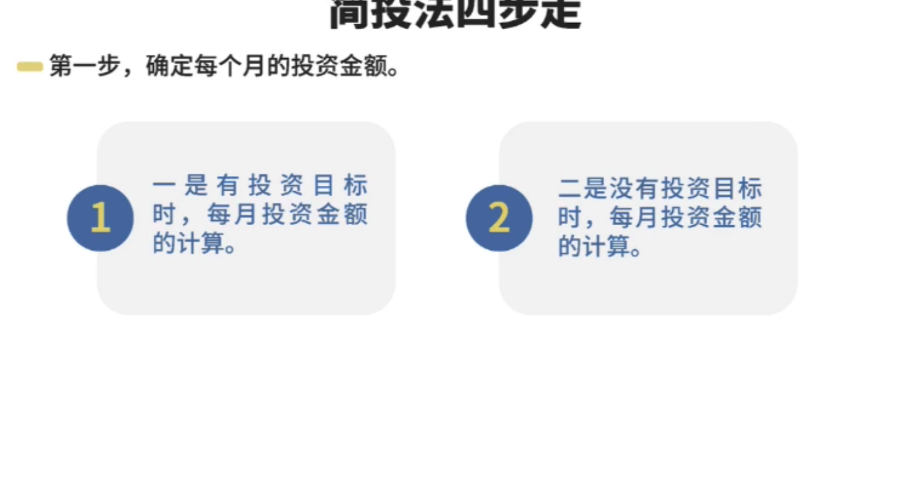
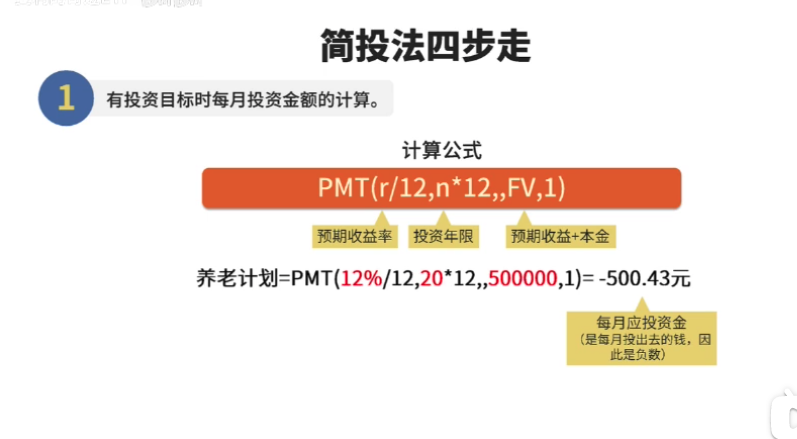
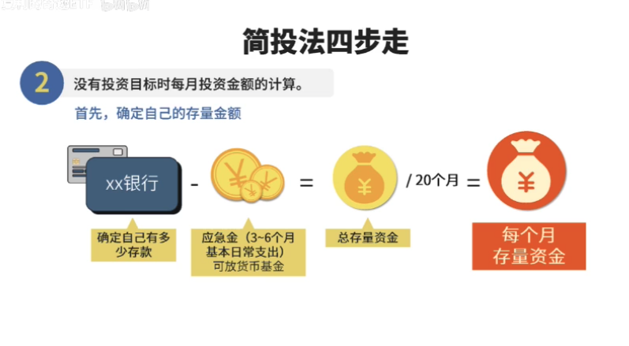
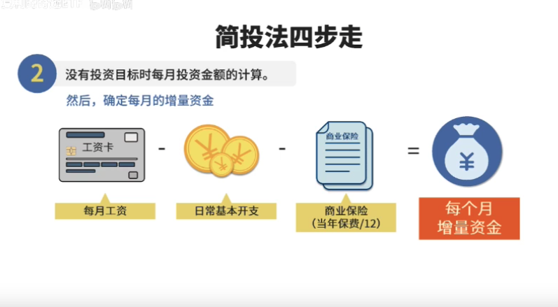
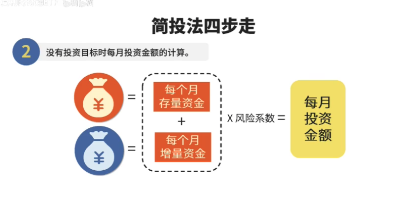
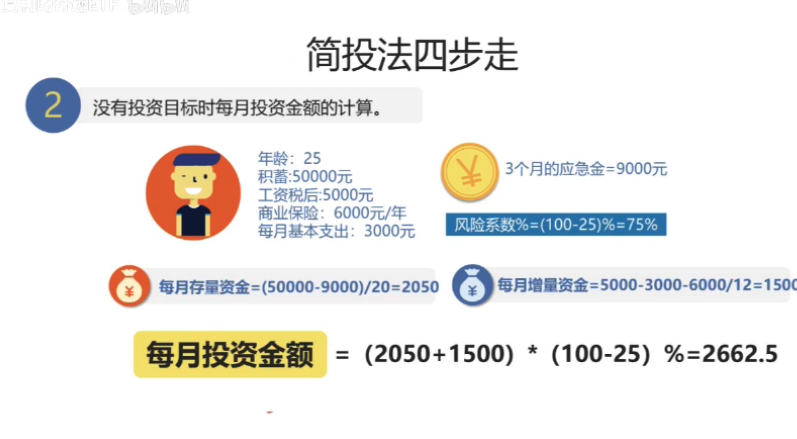

# 资产配置与平衡

### 投资分配

50% 股票  赚钱多

50%债卷   主要是避险，可以抵消通货膨胀。 手里的钱不会毛

房产，在成熟市场中，主要是为了分散风险。很难赚钱。问题在于：地税、后期维护、如果出租，房客会有突发情况

股票进场时机不重要，关键在于持续投资

40% 股票、

### 股市投资方法

### 平均成本法

，优点 少赚，但是也少陪。

距离，有100快，就分成12份，每个月投一份。

重新分配

当设定股票和债卷比例，如果股市涨了，可能两边的价值，就重新调整。

比如股票编程60，债市40了。那就从股票里拿出10块，投到债市里。

反之也一样

# 1. **确定金额**

## 3. 资金配置

## 1. 5:5 股债平衡

这就是最简单的投资策略之一

### 核心策略是

#### 资金分配

- 25%    沪深300
- 25%        中证500
- 50%        利率债

#### 买卖机制

定期或者定幅再平衡

- 三个月或者六个月操作一次，恢复各品种初始比例；
- 或者某个品种上涨50%后触发定幅操作机制，恢复各品种初始比例

你别看这种策略简单，秒杀60%的A股投资者毫无问题。

