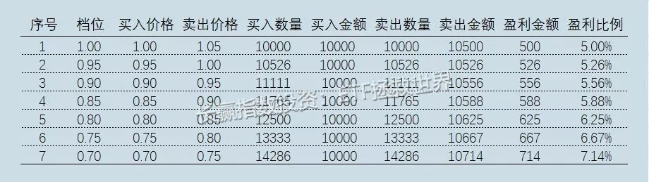
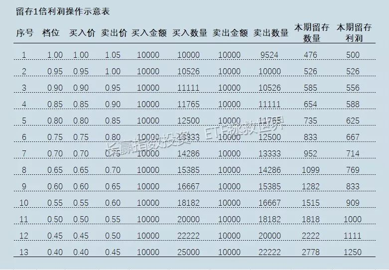
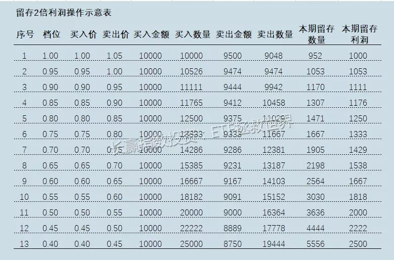
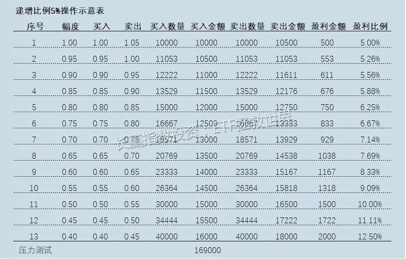
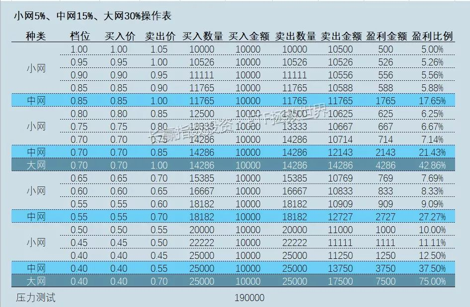
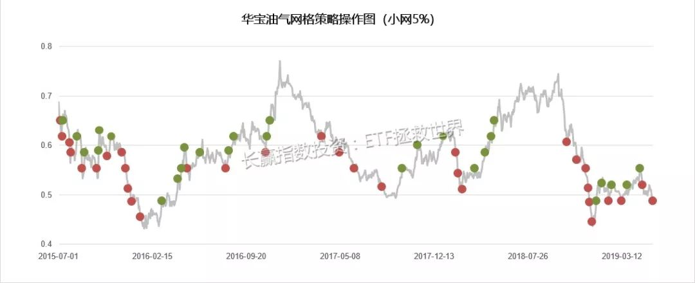
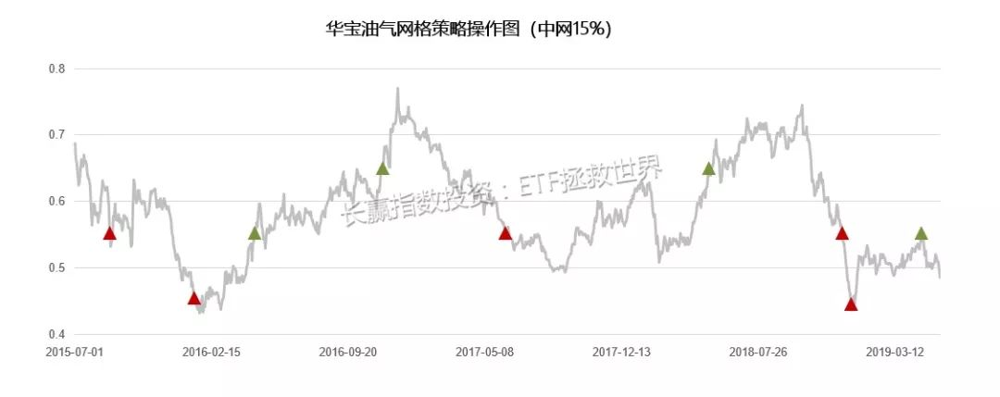
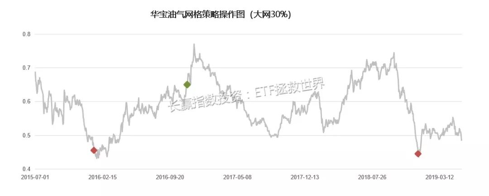

# 网格策略

# 2. 网格策略-v1.0

始于年初的这波上涨，最近回调不少。尤其是今天开盘，受利空消息影响，大幅暴跌。这种时候，波段策略的优势就充分体现了出来。与长期持有也许会经历不断坐电梯不同，波段策略可以吃到震荡时期每一个波段的利润。

金融投资最重要的是什么？

是低买高卖。

## 2.1 网格策略的整体思路

市场震荡

\- 人类无法预判金融市场的中短期走势

\- 长期则不同。好东西长期看大概率会涨，这也是理性投资者能获得收益的根源所在。

\- 然而长期究竟有多长，很难有个定义。

也许明天就能价值回归，也许十年后，也许二十年后。除去基本面的因素，还有很多外部因素也许会导致很久很久，甚至二十、三十年那么久某类金融产品无法上涨。所以即使长期，也未必100%就一定会有好事发生。

所以你应该理解，我们应对的金融市场，至少中短期的未来，就会有三种走势：

上涨、震荡、下跌。

我们要做的，是让自己在任何一种可能发生的时候，无论从事实有又或者心理层面，保持冷静。

其实有意思的地方在于，在金融市场，你的行为与心理通常会一荣俱荣，一损俱损。

良好的心态可以让你做出理性的行为，

而理性的行为取得的好收益反过来又会让你的心态更好。

相反，你可以观察失败的投资者，一定是心理状态影响操作，而差劲的操作又影响心态。

所谓无论胜利还是失败，都是一种习惯，也跟这个情况有很大关系。

如何在震荡市中保持良好的收益与心态，这是每一个投资人都应该考虑的。不要说死死拿住就等爆发的那一天。

一小部分人可以做到，对于大多数投资者来说，收益率像电梯一样起起伏伏是不可接受的。

他们会因为上一次在高点没卖跌了下去，下次就会随时卖出，最终与大钱擦身而过。

网格策略就是一种可以帮你在震荡市中获取一定收益，以及极大缓解焦虑的优质策略。

然而，所谓“优质”的前提，是你一定要深刻理解和认识它。尤其是它的弱点。

### 1）网格的基础策略

开始网格，你需要做的事情非常简单：

\1. 第一步：确定交易品种。

\2. 第二步：列出网格表格。表格中包括交易价格、交易金额、交易日期。

\3. 第三步：做压力测试。

\4. 第四步：设置交易提醒。

\5. 第五步：按照交易提醒进行交易。

## 2.2 挑选交易品种

开始网格策略前，你需要确定的是适用该策略的交易品种。

我给你一个适用范围底线：

\1. **你要做网格的品种，一定是有底的品种。也就是说，不会死的品种**。

\2. 最佳品种，当然是那些没完没了的上下折腾，几年后回头一看我去你怎么一点都没动啊

最佳品种，当然是那些没完没了的上下折腾，几年后回头一看我去你怎么一点都没动啊。这种品种简直可以说是网格策略的最佳伴侣，如果你能找到一个，基本上就等同于你找到提款机了。

当然，长期会缓慢上涨的也可以做。只要你把网格和你的长期持有策略结合就好。这样，你获胜的概率就变成了2/3——一个品种上涨、下跌、震荡三种可能性中，你已经能搞定两个可能性，基本上你已经赢了。再想想办法，把下跌也解决掉，你在资本市场还会输吗？

**关键参数：波动系数**

如果上证50-以50ETF为交易品种-的波动系数是1，证券ETF是1.4，白银是1.4，黄金是0.6，创业板ETF是1.6，华宝油气是1.8，**中证500是1.5。**

**系数越大代表它的波就越大，越适合进行网格交易**

,再分别计算它们的10年以上的日平均振幅,最后选择最大日振幅的一只股票长期操作,最好日平均振幅要大于3%。

## 2.3 压力测试

**压力测试是最重要的**。

压力测试分两种

\1. 利用真实数据，在确定下来的网格和交易品种，根据历史交易数据做回测。

\2. 模拟最大下跌幅度，计算出根据设计的网格，会造成多大幅度的回撤。

**最大下跌幅度**

就是该品种历史上的最大下跌幅度来测，上下 10%都可以，

如果你真的不知道到底应该给多少最大下跌空间，你可以参考ETF计划里面每次关于指数最大跌幅的判断。在那个基础上，再加10%基本上就是铁底。

具体如何交易，我接下来会说。但我再说一遍，压力测试一定要做。

一定。因为这是最重要的。

## 2.4 关于交易价格的几个细节

### 1）第一个，设定交易价格。

回到设计表格这个步骤。打开excel，或者自己画一张表，列好买卖交易价格、交易金额、交易日期。

其中价格部分，如果从1开始，以5%幅度为一网，则买入价格分别为：1、0.95、0.9、0.85、0.8……卖出价格除第一网1.0买入的要在1.05卖出外，其它每一网都是上一网的买入价格。

即，0.95买入的一网，1元卖出；0.9买入的，0.95卖出，依次类推。

所以，你1元买入的部分，在1.05清仓，赚到5%利润。0.95买到的，在1元清仓，赚到5.26%……最终，在0.7元买入的部分，0.75清仓，则这部分收益率就可以到7.14%。

你可以想象一下，如果一个品种不断地在20%-30%范围内波动，你不断的用5%网格收割，收割完成后将资金买入货币基金，那么这部分资金的年化收益率会非常令你满意。

所谓网格，就是我们要织一个密不透风的大网，将每一笔进入这个大网的利润吃掉。

下面是一个例子表格，供你参考。

是的，这就是一个最基础版本的网格交易模板。非常简单、粗暴、易用。

我称之为1.0系统。要理解2.0和3.0，你必须搞清最基础的1.0。

更重要的，你要知道这个策略最关键的点在哪里。

再来一张过去几年华宝油气应用网格1.0的情况：

可以看出，从开始的时候到现在，价格一路波动涨涨跌跌，最终不仅没涨还跌了。但你哪怕只用1.0，每一笔都在低买高卖，整体看也有非常不错的收益。这不是因为你操作能力强，而是因为你用对了策略。

### 2）第二个细节，关于开始的时机。

最好的开始时机，是价格略低于价值的时候。价格太高，买入的部分很难赚钱。价格太低，赚不了几次就飞了。

至于什么时候是价格略低于价值，很难给你一个统一的标准。你可以观察ETF计划，如果我们开始买入，就至少说明这个东西不太贵了。

### 3）第三个细节，关于网格大小。

1.0系统中，普通的品种我一般给5%。波动大的品种，比如券商指数，我给10%。供参考。

### 4）第四个细节，走势相似的品种不要重复开。

比如，都是大盘股指数，50和300你就别开两个网格了。占用资金过多也不是好事。意义也不大。

## 2.5 挂单以及交易提醒

有些品种，比如银行纸白银或者纸黄金，就我所知甚至可以无限期挂单。这样的系统对网格交易就极为友好。你可以按照预订价格，上下各挂2、3网，然后去吃喝玩乐。当价格走势碰到你设定的价格，系统会提示你成交，然后你再去加一档买入卖出，继续去吃喝玩乐。

有些品种则不支持长期挂单，比如绝大多数ETF。这时候你就需要交易提醒软件。这个我也不推荐了，很多交易软件都可以实现。PC也有，手机也有。当价格碰到你的设定价格，警报跳出，你打开软件交易下单，然后关闭软件，又去吃喝玩乐。

当然，如果你能自己写挂单交易软件自动运行，或者雇一个交易员那就是最完美。

这样你就可以一直吃喝玩乐了。

## 2.6 语重心长的提示

世界上没有完美的交易策略。我告诉你，绝对没有。

没有策略可以让你在下跌时候不赔钱，上涨时候赚大钱，震荡市提款。没有。就像没有任何投资者可以在每一个时间段内表现出色。即使长期看最牛的投资者也做不到。

所以，你需要组合你的策略。将中短期策略与长期策略组合，来应对未来可能发生的事。

根据上一篇文章中提到的观察系统带来的观测结果，将不同权重动态分配在各个交易策略上。

通俗的说，就是有时候中短期策略多分配一些资金，有时候长期资金多分配一些。

当然，你也可以从另一个角度思考：我能不能将中短期波动策略用某种方式与长期策略结合，来一定程度弥补它的固有缺陷（大牛市赚不到大钱）？为什么不可以？我们的2.0、3.0就是做这个的。之后细说，别急。

跑远了，拉回来。没有完美的策略，所以网格策略也一定不完美。有适合它的品种和周期，就一定有吃瘪的时候。但只要你从根本上认识它的缺陷，你就能改进它，或者做好足够的准备。

我的意思，是千万不要对它寄予不切合实际的厚望。即使升级后，已经一定程度上弥补了固有缺陷，也远未完美。

最后，也请朋友们认真思考一下：这个交易策略的最大缺陷是什么？如果是你，你会如何弥补它？如果想不到，就回到上面看华宝油气那张图，认真看，仔细看，看到眼睛花了为止。

好了，让咱们一起期待下一篇文章的到来。其实我建议你看过升级版的网格策略再开始操作。不过如果你着急想试试1.0，也不是不行，但我建议你再把这篇文章读五遍。当然，你只读一遍也可以。不过未来你真的实践后再来看这篇文章，一定会后悔没有多读几遍。

知道为什么吗，

因为，

本人对近十年实践网格策略的失误和教训的反思和总结都在这篇文章里了。

这3511个字，会为你节省5-10年的试错时间。

它多么有价值，也许你永远都意识不到。

就像我的其它文章一样。

# 3. 网格2.0

## 3.1 网格1.0的问题

上次让各位先自行思考网格1.0的问题。

大家可以再看下面两张图，那么1.0的问题到底有哪些呢？

很明显，最大的问题在于，在一波强势上涨中，赚的不够多。

大家看2015年底到2016年底这一波接近80%的暴涨中，你的每一格投入只赚了5%-8%。

没错，你的所有投入都赚钱了，之后的下跌你也全都躲过了，但是我告诉你，99.9999%的人都会极度不满意自己的这波操作。

尤其是当这个品种从0.4涨到接近0.8，你看着交易记录中自己在最低位买入的居然只赚了7%就卖掉了，一定悔恨不已。

然而如果你足够理性，你就应该知道，悔恨毫无用处。没有时光机器让你回到几个月前再来一次。所以你最应该做的，是改进你的交易策略，下次做得更好。

赚少了，没关系，我们升级。

我们的2.0，是由若干子策略集合而成。你可以组合使用，也可以单独使用。丰俭由人，各取所需。

## 3.2

### 3.2.1 留利润

2.0的第一个子策略，叫做留利润。

每一次网格卖出操作中，你可以把利润留下。因为这部分是0成本，所以你可以无限期持有。

金融心理学告诉我们，人们很容易把持仓品种分为不同的心理账户。

那么，我们不如就将这部分0成本的利润，做为“免费得到”心理账户的品种，长期持有。无论它如何波动，因为是“赚来的”，所以在正常人的认知中，它都不会带来情绪化上的变化。

各位要知道，由于经济发展以及通胀的影响，绝大多数指数型品种长期看都会一路向上。所以你的网格利润自动转换成长期持有的部分后，会为你带来长期良好收益。

留利润子策略具体做法：

举例，1元价格买入10000元某品种10000份。1.05卖出10000元9524份，剩下的476份永不卖出，或者到极度高估的情况再卖。

这个子策略，你还可以继续进化。

比如：留双份利润，留三份利润。

怎么理解？你一格赚了5%，但因为这时候已经跌得太多了，你可以不仅留下5%的利润，还可以留下5%甚至10%的本金。

即，1元价格买入10000元某品种10000份。1.05留双份利润，卖出9048份9500元，500元利润与500元本金永不卖出，或者极度高估才卖。

### 3.2.2 逐格加码

这个很容易理解。

只要一个品种不会死，一定是价格越低价值越大。

同时，见底以及波动的可能性也逐渐增加。

所以，每一格增加一定投入，最终可以获取更大的利润。

这也一定程度上缓解了1.0系统中底部利润过低的缺陷。

怎么加呢，永远要牢记压力测试的重要性。

列表格，列出最坏情况下自己是否还能坚持。然后逐渐加码，你可以尝试从第二格开始，每格比上一格加5%。

算到最后你发现自己资金和心理状态扛不住了，没关系，那就从第三格开始加码，前两格用同样的金额。如果还是扛不住，那就从第四格开始。

如果你发现到最后自己的状态也非常轻松，那就每格增加7%，或者10%。总而言之，因为所有交易在交易开始前你就已经开始计划，所以无论如何调整都没有任何问题。只要你不过高或者过低估计自己的实际情况，那么怎么调整细节是非常自由的。

### 3.2.3 一网打尽

这是网格2.0系统的终极大招，会让利润疯狂奔跑的子策略。

各位可以想象一下，自己是出海打鱼的渔夫。这时候你需要面临选择：

如果你带的网很密，那你会把所有小鱼抓走。

但这样做的问题在于，你把所有小鱼苗都抓走了，它们永远也无法长成大鱼让你吃大肉。

然而如果你带的网眼很大，

确实能捞到大鱼，但碰到大鱼的机会很低，可能一年也抓不到一只。

那么，发挥你的聪明才智：能不能同时多撒几个网？

好了，2.3子系统登场。大网，中网，小网一起上。

如果把5%的网格当作小网，那么你可以再设置一个15%的中网，一个30%的大网。把你的资源分配到三个网格系统中。用5%的网格满足日常生活所需，15%的网格改善生活，30%的网格赚大钱。

什么？你说30%不是大钱？朋友，0.3/0.7=43%。大网第一网就是43%的利润，如果你有幸买到第二个大网，那么利润就是0.3/0.4=75%。够大不够大？

具体做法：

中网、大网操作方法与小网一致，但网格幅度升至15%以及30%。当然，这两个数字你也可以自己调整，比如10%和20%，又或者20%和40%。无所谓。

中网0.85、0.7、0.55……买入的，分别在1、0.85、0.7卖出。

大网0.7、0.4买入的，分别在1、0.7卖出。

依然是拿出表格，做压力测试。

有朋友问，为什么大网一网可以赚43%和75%，那么我们干嘛不把所有资源投入到大网上？还要做5%的小网？

很简单。未来是未知的。如果整个品种长期只在10%-20%的范围内波动，你的大网一网都赚不到，而别人的小网已经赚了很多。记得之前大鱼的例子吗。

这是华宝油气四年来大、中、小网操作示意图。

## 3.3 写在最后

网格策略是我整个投资体系中的一部分。如前所述，它有缺陷，但又不可或缺。

它能在震荡市中提供源源不断的利润；它能满足各位无处安放的交易欲望；它能避免上上下下坐电梯而又无法实现利润的焦虑感。

它不完美。世界上没有完美的人，没有完美的物，也没有完美的交易策略。我们要做的，是思考如何把不完美的策略，不完美的品种，有机的组合在一起，尽量让自己的交易体系生命力更强，更抗打击，更能茁壮成长，赚更多的钱。

从这几篇文章中，各位也应该能看到，我对事先计划有多么重视。总有朋友问我，我的某某股票套住了，怎么办？我的某某基金赚钱了/赔钱了，我该卖吗？

对我来说，这些问题无法回答。我说卖，明天开始暴涨怎么办？我说拿着，明天继续暴跌怎么办？我不知道这些问题的答案。

我之所以不知道这些答案依然能在资本市场活得很好的原因，是我永远不会让这些问题出现在我的投资中。我的所有持有或者卖出计划，早在买入前就已经制定好。买入后无论上涨/波动/下跌，我都有预案。有朋友说我总是很淡定，这不废话吗，能不淡定吗？我在买入前都已经无数次沙盘推演现在情况出现后的情形，真发生了只是预料之中，有什么不淡定的？

最后，我想说，我的每一套策略都像我自己的孩子。这样事无巨细公开拿来供大家参考，其实还是并不舍得。但再想想，也就释怀。

最重要的，是我认为这几篇文章能帮助很多朋友。因果循环，帮的人多了，自己也一定会更好，这并不坏。

第二，毕竟只是体系中的一个策略，何况还在不断进化，拿出来大家一起思考没准能碰撞出更大的火花。

各位从这几篇文章里，无论从文字还是各种图表，都能看出我的诚意和用心。无论如何，如果能给你一点小小的启发，我就非常高兴了。

之前想说把网格3.0也一起拿出来供参考。但3.0的问题是与1.0和2.0相比，需要更多的主观判断，同时也远未完善，所以就暂时不说了。以后更成熟一些再拿出来与大家分享。

再说一次，如果你要尝试这个策略，请再阅读这三篇系列文章至少五次，把我着重强调的东西融合到你的交易计划中。这样，才有可能尽量减少你的试错成本。

祝各位投资顺利。

# 策略参考

\- ETF拯救世界的公众号

[不知道哪位交易员可以解释下网格交易法？](https://www.zhihu.com/question/39851961)

[网格交易致命弱点是什么？有什么好办法克服？](https://www.zhihu.com/question/41829464)

[网格交易实战心得](https://zhuanlan.zhihu.com/p/84355858)

[网格交易法：震荡市最好的投资策略](https://zhuanlan.zhihu.com/p/21839892)

[理性的仓位策略--论网格交易法](https://xueqiu.com/2882402917/34082502)

[我在做网格交易时候的一些心得](https://medium.com/@gintayo/%E6%88%91%E5%9C%A8%E5%81%9A%E7%BD%91%E6%A0%BC%E4%BA%A4%E6%98%93%E6%97%B6%E5%80%99%E7%9A%84%E4%B8%80%E4%BA%9B%E5%BF%83%E5%BE%97-37fa58974e34)

[很难亏钱的网格交易策略介绍及缺点解决办法](https://zhuanlan.zhihu.com/p/42925398)

[网格交易，永不止损，活得下去吗？](https://www.zhihu.com/question/40653581)

[网格交易法的精髓是什么？漏洞在哪里？](https://www.zhihu.com/question/321029976)

[有没有亲自长期用网格法，交易股票或期货的人，能分享一下你的心得吗？](https://www.zhihu.com/question/355039559)