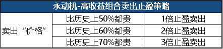

# 长期持有的交易策略

## 1. 核心策略

### 2.1. 定期存钱

不论市场行前如何，把一定的工资比例的金额存入定投账户。

先不管这笔钱是否会投出，都先存入。以保证后续有投资需求的时候，有足够的子弹。也是强制储蓄的一种方法。

比如每个月固定把工资10%、15%、20%投入账户。

### 2.2. 买入机制

#### 2.1.1. 是否定期买入

##### 1) 定期买入

每个月、或每个星期定投100或者是1000，频次和金额都根据个人需求和喜好去设定，从而定期定额地投。

##### 1) 不定期买入

根据特殊时机来决定是否买入。

#### 2.1.2. 是否定额买入

##### 1）定额买入

每个月定时买入某个品种

  - 积少成多
  - 集腋成裘
  - 平滑成本

下面是简单的模拟操作，来解释长期定投为什么有这些优点

##### 2）不定额买入

#### 2.1.3 组合情况

##### 1）不定时不定额 - 越跌越买

越跌越买，什么意思？
平常可能是一个月投一次的，当市场在往下走，在不断的大跌的时候，现在可以提高频率改成一周一次。

另外是可以改变金额，以前可能是一次100，现在可以一次200、500，甚至1000，反正越跌频次就越高，或者买的金额就越大。

当市场开始往上走的时候，又回归到原来的频次，原来的金额。

#### 2.2.4. 买入机制模拟

##### 情况 1 大跌后价格回归

我们举个略微极端的例子，abcde五天行情如下图：

我们用定投的方法，在abcde五天，各买入1000元，

最后的收益：

（份数 * 当前价格 - 成本）/成本

= [（1000+1333+2000+1333+1000）* 1 - 5000]/5000

= 33.32%

基金从a点先下跌后上涨到e点， 回到最初的起点，我们的盈利却高达33.2%。

##### 情况 2 震荡市

在abcd四天，我们同样每天各买入1000元，

最后的收益将是：

份额/成本*100%-1=(1000+500+2000+1000)/(1000*4)

=112.5%-1=**12.5%**

基金从a点大起大落后到d点，回到最初的起点，我们依然有12.5%的收益！

##### **为什么呢？**

最核心的原因就是：在大幅震荡的市场，**通过定投分批买入的方式，我们在低位买到了较多便宜的筹码，摊薄了我们的持仓成本**，所以当基金回到初始点位时，我们处于盈利状态。

2- 每当定投策略收益率降至-20%以下，启动加倍定投

  - 将成本更快降下来

### 2.3. 卖出机制

设定一个卖出触发点
- 比如整体盈利100%
- 或者年化盈利20%即卖出

这些都是最最简单的投资策略。

你看，即使你对什么都不懂的投资小白讲一遍，他也会马上就懂。

千万别以为简单的东西都是弱智的东西，我相信长期看，至少一半的专业投资者跑不赢这些最简单的策略。

**WHY**

*为什么？这样卖出，难道不是应该在有大跌风险的时候卖出吗？*

## 2. 定投策略优化

### 2.2.1. 优化思路

优化点：
- 买入策略
- 卖出策略
- 资金分配

优化的目标
- 收益率会更高
- 回撤会更小

### 2.2.2. 优化后的买入规则

后来我升级3.0策略后，我开始定投买入。还设置了一套买入、卖出策略。

我们的**具体买入规则为：**

###  2.2.3.  优化后的卖出止盈规则

我们的具体卖出止盈规则为：

**这样，按策略量化操作即可。**

**我不用花多少时间，也不受情绪影响。**

**省时、省力、省心。**

## 3. 资金盘整策略

