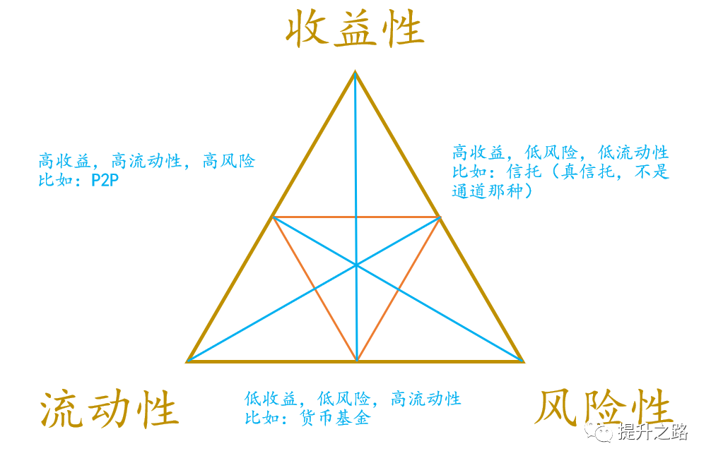
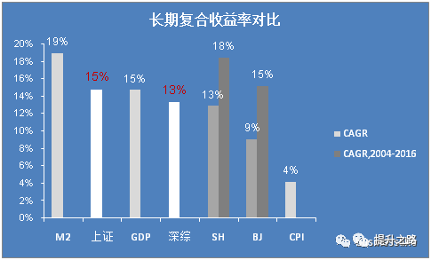
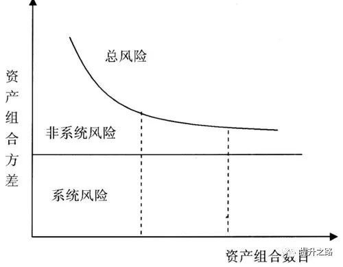
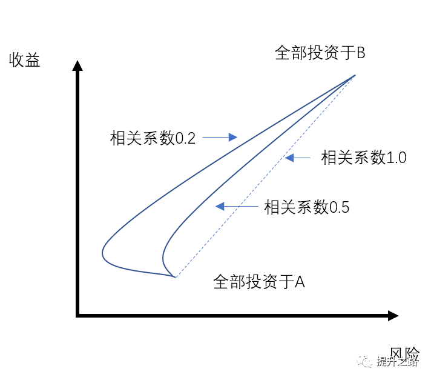
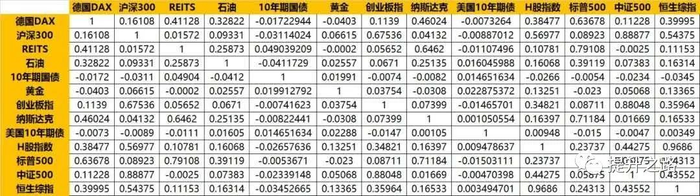
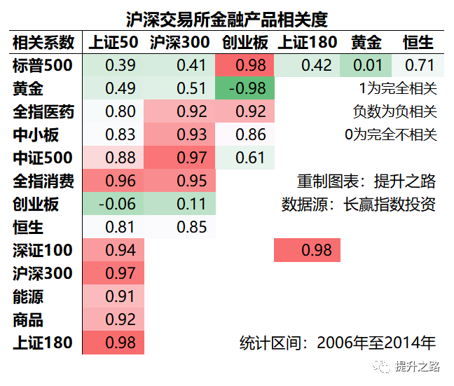

# Kindy
[TOC]
## 研读方式

### 前言

E大的笔记超过1万条（篇）记录。如按每篇分析心得，估计1年都研读不完，因此我觉得研读思路要改变。

### 正文

因我已跟随E大投资策略近四年，大致理解他的投资方法论。
故此，本次研读直接按 **策略-复盘** 方式。

- 先总结E大的策略
- 根据各策略，检索原文
- 按时间线复盘。

而E大邮件内容，未取得他授权前，不公开该部分研读。

首先，一句话总结ETF拯救世界的投资方法：

- 交易策略: 估值模型为基础，趋势交易为辅助，
- 资产配置: 对不同品种（包括A股、港美股及其他股票市场、以及金、银、油气等）资产配置，以获取目标收益，
- 投资标的: 主要投资标的物为**ETF指数基金**

上面这段话，已经包含了投资的几个关键要素：

- 什么时候买？
- 什么时候卖？
- 买卖什么？
- 能赚多少？
- 风险多大？

再翻译下就是：

- E大通过对各类指数进行数据分析，买低估指数
- 在高估时结合趋势模型卖出
- 买卖时通过结合历史数据可算出**收益和回撤的概率**

因此，本次研读的策略包括：

- 估值模型
- 趋势模型
- 资产配置
- 目标收益
- ETF指数基金等几大模块

逐个检索E大原文，以及结合时间点分析当时的操作。

[原文](https://mp.weixin.qq.com/s?__biz=MzIyODE3NDE4Mg==&mid=2649860241&idx=1&sn=48ac932a5a6fb914a8f2f4944b754c84&chksm=f050f898c727718ef8b94478ea9a42dcff5d4d28cfed7be87e3ee4ff5af03d46549c5c891ebd&scene=21#wechat_redirect)

---

Date: 2020年03月02日
Source:
Tag: #笔记

## 投资本质

资的本质，是资金配置的艺术。如何将有限的资金，在恰当的时机配置在金融、房产、收藏品等领域，是每个人需要面对的问题。

[对应笔记](../KOL/ETF拯救世界/公众号/20150611-2015年三季度金融资产配置建议.md)

### 为钱找最合适的地方

最近十几年，大家最大的感受是——钱不值钱了。如果单纯存钱，过一段时间买东西时，钱已经买不了同等多的东西了。这种就是大家熟知的通货膨胀的结果。

因此，当手头有一笔钱时，我们首先想到的是，如何才能让这笔钱不贬值，当然能变多更好。这时，就需要为钱找最适合的地方——资产。

### 怎么样才算合适

如何评判找的资产合不合适呢？

我们经常会考虑：钱投入后，能赚多少钱；需要多久才赚到；急用时可不可以随时取出；会不会出事拿不回来……

上面考虑的，就是投资的常用的评估指标：

- 收益性
- 流动性
- 风险性

类似货币的“蒙代尔不可能三角理论”，就是无法同时满足高收益，高流动性而且低风险。

上面提到的“能赚多少钱，需要多久才能赚到”，就是收益性，这两个合为一个指标来衡量，就是年化收益率。

年化收益率把各种投资时间长短不一，投资收益大小不同，回款节奏千奇百怪的投资品，统一到同个标准进行对比。下面就是不同投资品在2004-2016年期间的收益率对比。

来源：微信公众号：businesslike，文章：什么是90%人最好的投资?(1)

而风险也能通过一些模型转成类似年化的统一标准。这样就可以对“锁定资金相同时长”的不同投资品比较了。

### 如何做好资金分配

有了评估标准，接下来有决策的依据了。在某个时点，选择什么投资品，买房子？买股票？还是买黄金？这就E大说的“资金配置的艺术”，而除了决定买什么，还需决策各买多少。

## 分散投资

**前言**

要做好资产分配的评估。接下来决定钱投到哪里，首先是分散投资。

### 为何要分散

> 分散投资的原因，是未来的不确定

[ETF拯救世界，公众号：长赢指数投资问答（2）：没人能替你做资产配置，除了你自己](../KOL/ETF拯救世界/公众号/20161211-问答（2）：没人能替你做资产配置，除了你自己.md)

假如可以穿越回到十年前，你会告诉当时的自己投资什么呢？中国房产？美国股票？还是比特币……

现在呢？现在让你选未来十年的投资产品，你又会选什么呢？

我选？我不知道！因为**未来是不确定的**。那怎么办？没办法选资产了吗?

当然有，我们需要一个，不管哪类资产涨的情况下，我都能赚到。还记得之前我一直说的吧“**[先胜而后战](http://mp.weixin.qq.com/s?__biz=MzIyODE3NDE4Mg==&mid=2649860334&idx=1&sn=3617ae69ff2a3a65b2c0fb770104ee0d&chksm=f050f8e7c72771f1131ccfe29da520efe87c9740d6ca1083afd9c34eea456ea20d801c6dd3e4&scene=21#wechat_redirect)**”。

首先，需评估各种资产未来涨的概率是多大？然后都投一些，而不是“赢了会所嫩模，输了下海干活”，那不是投资，那是赌博。想赌博的请主动取消关注，出门右拐大把“股（du）神”。

现代投资组合理论研究，简单总结如上图，**随着资产组合数目的增加，整体资产的非系统性风险是在下降的**。当然，资产组合超过一定数量后，风险下降的效果就不太明显了。

其次，分散投资可以在保证总体收益稳定的情况下，降低资产的风险。但还要基于资产组合需尽量不相关。

### 为何要不相关

因为同类型资产同涨同跌，根本起不到对冲风险的作用。
下图就是相关系数对收益和风险的影响，看不懂也没关系，只要记得：
**越是不相关的资产组合，越可以做到风险低且收益高的最优方案。**

### 哪些资产不相关

我们平时观察下，某类资产跌时，什么资产就涨。
大类资产的话，

- 如美元跌，黄金涨；
- 股票跌时，债券涨等等。

但这种只是感觉，具体数据表现，下篇继续研读E大提供的相关系数表格。

## 相关系数

上篇研读了为何要分散投资，结论是越不相关的资产组合，越可以做到风险低且收益稳定的最优方案。那如何配做到分散？接下来就要看，资产的相关度系数。

### 什么是相关度系数

假设“雨天买雨伞，晴天买扇子”。

如果买伞和买扇的行为是相反，这种完全负相关的系数是-1。

如果雨天也必须买雨靴的话，则买雨衣与买雨靴的这种完全相关的系数是1。同理，买扇跟买雨靴相关系数就是-1了。

而如果买充电宝，这时跟买伞买扇完全没关系的，则充电宝跟以上两者分别这种完全不相关的相关系数是0。

因此，**相关系数就是两种不同资产表现的变动关系参数，从-1到1来衡量两个资产收益率之间相关性的强弱。**

>相关系数的取值范围 -1<= r <= 1，正数表示两个品种正相关，也即通常表现为同涨同跌，反之亦然。一般来说，相关系数绝对值在0~0.09认为没有相关性，0.1~0.3为弱相关，0.3~0.5为中等相关，0.5~1为强相关。

下图给出的是且慢回测2007.7.1- 2017.6.30期间各类资产的相关系数，供你参考。

ETF拯救世界，且慢app，温故知新频道

来源：ETF拯救世界，且慢，温故知新频道

E大发的主要是沪深股票交易市场的资产相关性。引用来源如下：
> 2006年至2014年，中国金融资本市场，可以在沪深交易所购买的金融产品相关度
公众号：长赢指数投资
2015年三季度金融资产配置建议

请注意！经过检索E大的所有文章，上面数据很珍贵，记得保存。邮件虽然推送有多次涉及，但不是公开平台。

且慢E大的两个栏目“E大问答”和“温故知新”，原先“E大问答”需在且慢有投资才可见，故且慢不被列为公开平台。今天用另一未投资的号看了下，两个频道均可正常观看。筒子们，记得去且慢app看E大的原汁原味文章。

除了上图（该数据2014年3月雪球首发，略有差异），雪球发过的另一张图，原图本身比较模糊。

来源：ETF拯救世界，雪球，2015年9月22日

### 每种资产配比多少

有了相关系数后，我们知道尽量选相关性低，甚至不相关的资产来组建投资组合。但需要多少种呢？每种占比需配多少？下篇继续研读。
