# 1. Kindy

[TOC]

# E 大策略
## 1.1. 序

[研读丨ETF拯救世界：序](http://mp.weixin.qq.com/s?__biz=MzIyODE3NDE4Mg==&mid=2649860149&idx=1&sn=bafa17358f347aa99adb3b54dfa86162&chksm=f050f83cc727712a71f51ab8dfec696de91cac28d12e7494d95f3b556312077b7d66039e449b&scene=21#wechat_redirect)

## 1.2. 研读方式

[研读丨ETF拯救世界：研读方式](http://mp.weixin.qq.com/s?__biz=MzIyODE3NDE4Mg==&mid=2649860241&idx=1&sn=48ac932a5a6fb914a8f2f4944b754c84&chksm=f050f898c727718ef8b94478ea9a42dcff5d4d28cfed7be87e3ee4ff5af03d46549c5c891ebd&scene=21#wechat_redirect)

### 1.2.1. 前言

E大的笔记超过1万条（篇）记录。如按每篇分析心得，估计1年都研读不完，因此我觉得研读思路要改变。

### 1.2.2. 正文

因我已跟随E大投资策略近四年，大致理解他的投资方法论。
故此，本次研读直接按 **策略-复盘** 方式。

- 先总结E大的策略
- 根据各策略，检索原文
- 按时间线复盘。

而E大邮件内容，未取得他授权前，不公开该部分研读。

首先，一句话总结ETF拯救世界的投资方法：

- 交易策略: 估值模型为基础，趋势交易为辅助，
- 资产配置: 对不同品种（包括A股、港美股及其他股票市场、以及金、银、油气等）资产配置，以获取目标收益，
- 投资标的: 主要投资标的物为**ETF指数基金**

上面这段话，已经包含了投资的几个关键要素：

- 什么时候买？
- 什么时候卖？
- 买卖什么？
- 能赚多少？
- 风险多大？

再翻译下就是：

- E大通过对各类指数进行数据分析，买低估指数
- 在高估时结合趋势模型卖出
- 买卖时通过结合历史数据可算出**收益和回撤的概率**

因此，本次研读的策略包括：

- 估值模型
- 趋势模型
- 资产配置
- 目标收益
- ETF指数基金等几大模块

逐个检索E大原文，以及结合时间点分析当时的操作。

[原文](https://mp.weixin.qq.com/s?__biz=MzIyODE3NDE4Mg==&mid=2649860241&idx=1&sn=48ac932a5a6fb914a8f2f4944b754c84&chksm=f050f898c727718ef8b94478ea9a42dcff5d4d28cfed7be87e3ee4ff5af03d46549c5c891ebd&scene=21#wechat_redirect)

---

Date: 2020年03月02日
Source:
Tag: #笔记

## 1.3. 投资本质

[研读丨ETF拯救世界：投资本质](http://mp.weixin.qq.com/s?__biz=MzIyODE3NDE4Mg==&mid=2649860414&idx=1&sn=4d6e03dc51842675b487466f7ea62b63&chksm=f050f937c72770214182ffd627892d279828ad9bcd6d93feff6fa4c76da17fea00d068b48e7a&scene=21#wechat_redirect)
资的本质，是资金配置的艺术。如何将有限的资金，在恰当的时机配置在金融、房产、收藏品等领域，是每个人需要面对的问题。

[对应笔记](../KOL/ETF拯救世界/公众号/20150611-2015年三季度金融资产配置建议.md)

### 1.3.1. 为钱找最合适的地方

最近十几年，大家最大的感受是——钱不值钱了。如果单纯存钱，过一段时间买东西时，钱已经买不了同等多的东西了。这种就是大家熟知的通货膨胀的结果。

因此，当手头有一笔钱时，我们首先想到的是，如何才能让这笔钱不贬值，当然能变多更好。这时，就需要为钱找最适合的地方——资产。

### 1.3.2. 怎么样才算合适

如何评判找的资产合不合适呢？

我们经常会考虑：钱投入后，能赚多少钱；需要多久才赚到；急用时可不可以随时取出；会不会出事拿不回来……

上面考虑的，就是投资的常用的评估指标：

- 收益性
- 流动性
- 风险性

类似货币的“蒙代尔不可能三角理论”，就是无法同时满足高收益，高流动性而且低风险。

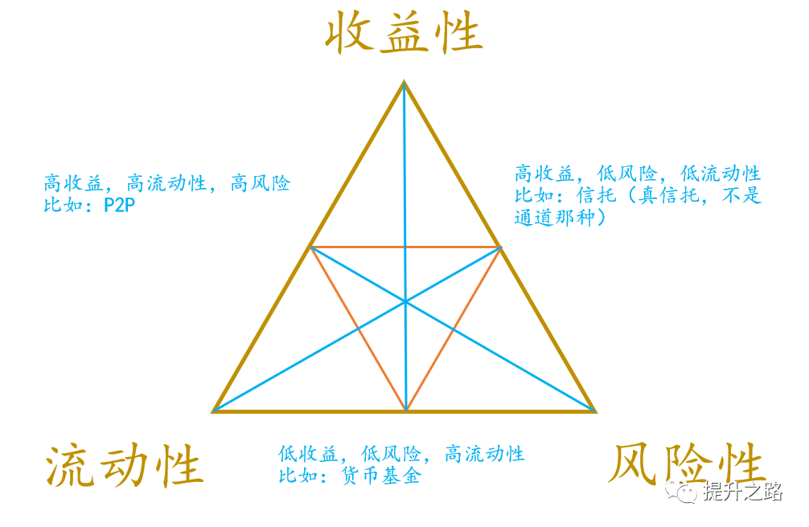

上面提到的“能赚多少钱，需要多久才能赚到”，就是收益性，这两个合为一个指标来衡量，就是年化收益率。

年化收益率把各种投资时间长短不一，投资收益大小不同，回款节奏千奇百怪的投资品，统一到同个标准进行对比。下面就是不同投资品在2004-2016年期间的收益率对比。

来源：微信公众号：businesslike，文章：什么是90%人最好的投资?(1)

而风险也能通过一些模型转成类似年化的统一标准。这样就可以对“锁定资金相同时长”的不同投资品比较了。

### 1.3.3. 如何做好资金分配

有了评估标准，接下来有决策的依据了。在某个时点，选择什么投资品，买房子？买股票？还是买黄金？这就E大说的“资金配置的艺术”，而除了决定买什么，还需决策各买多少。

## 1.4. 分散投资

[研读丨ETF拯救世界：分散投资](http://mp.weixin.qq.com/s?__biz=MzIyODE3NDE4Mg==&mid=2649860422&idx=1&sn=b1d5b20a06d48573ff39b15ba9cf3432&chksm=f050f94fc7277059f53e21f8f7410c4ac6050149c0f46726d9e209507554b12aab9f12252a22&scene=21#wechat_redirect)
**前言**

要做好资产分配的评估。接下来决定钱投到哪里，首先是分散投资。

### 1.4.1. 为何要分散

> 分散投资的原因，是未来的不确定

[ETF拯救世界，公众号：长赢指数投资问答（2）：没人能替你做资产配置，除了你自己](../KOL/ETF拯救世界/公众号/20161211-问答（2）：没人能替你做资产配置，除了你自己.md)

假如可以穿越回到十年前，你会告诉当时的自己投资什么呢？中国房产？美国股票？还是比特币……

现在呢？现在让你选未来十年的投资产品，你又会选什么呢？

我选？我不知道！因为**未来是不确定的**。那怎么办？没办法选资产了吗?

当然有，我们需要一个，不管哪类资产涨的情况下，我都能赚到。还记得之前我一直说的吧“**[先胜而后战](http://mp.weixin.qq.com/s?__biz=MzIyODE3NDE4Mg==&mid=2649860334&idx=1&sn=3617ae69ff2a3a65b2c0fb770104ee0d&chksm=f050f8e7c72771f1131ccfe29da520efe87c9740d6ca1083afd9c34eea456ea20d801c6dd3e4&scene=21#wechat_redirect)**”。

首先，需评估各种资产未来涨的概率是多大？然后都投一些，而不是“赢了会所嫩模，输了下海干活”，那不是投资，那是赌博。想赌博的请主动取消关注，出门右拐大把“股（du）神”。

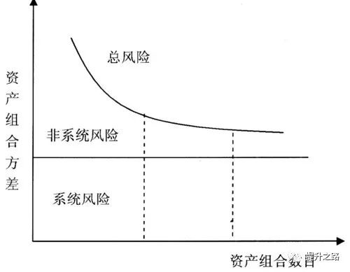

现代投资组合理论研究，简单总结如上图，**随着资产组合数目的增加，整体资产的非系统性风险是在下降的**。当然，资产组合超过一定数量后，风险下降的效果就不太明显了。

其次，分散投资可以在保证总体收益稳定的情况下，降低资产的风险。但还要基于资产组合需尽量不相关。

### 1.4.2. 为何要不相关

因为同类型资产同涨同跌，根本起不到对冲风险的作用。
下图就是相关系数对收益和风险的影响，看不懂也没关系，只要记得：
**越是不相关的资产组合，越可以做到风险低且收益高的最优方案。**

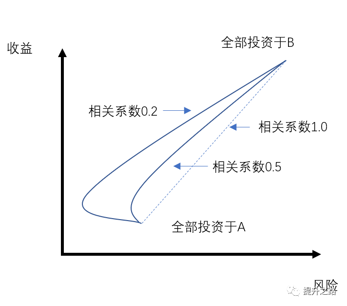

### 1.4.3. 哪些资产不相关

我们平时观察下，某类资产跌时，什么资产就涨。
大类资产的话，

- 如美元跌，黄金涨；
- 股票跌时，债券涨等等。

但这种只是感觉，具体数据表现，下篇继续研读E大提供的相关系数表格。

## 1.5. 不同投资标的的相关系数

[研读丨ETF拯救世界：相关系数](http://mp.weixin.qq.com/s?__biz=MzIyODE3NDE4Mg==&mid=2649860479&idx=2&sn=b5b753216745cfc17f0ab6437c8c8dda&chksm=f050f976c7277060ce9e6558b44f15b5a9980acb5747d99cd1ca02718f62dce8cdee5b8a8ec3&scene=21#wechat_redirect)
上篇研读了为何要分散投资，结论是越不相关的资产组合，越可以做到风险低且收益稳定的最优方案。那如何配做到分散？接下来就要看，资产的相关度系数。

### 1.5.1. 什么是相关度系数

假设“雨天买雨伞，晴天买扇子”。

如果买伞和买扇的行为是相反，这种完全负相关的系数是-1。

如果雨天也必须买雨靴的话，则买雨衣与买雨靴的这种完全相关的系数是1。同理，买扇跟买雨靴相关系数就是-1了。

而如果买充电宝，这时跟买伞买扇完全没关系的，则充电宝跟以上两者分别这种完全不相关的相关系数是0。

因此，**相关系数就是两种不同资产表现的变动关系参数，从-1到1来衡量两个资产收益率之间相关性的强弱。**

>相关系数的取值范围 -1<= r <= 1，正数表示两个品种正相关，也即通常表现为同涨同跌，反之亦然。一般来说，相关系数绝对值在0~0.09认为没有相关性，0.1~0.3为弱相关，0.3~0.5为中等相关，0.5~1为强相关。

下图给出的是且慢回测2007.7.1- 2017.6.30期间各类资产的相关系数，供你参考。

ETF拯救世界，且慢app，温故知新频道
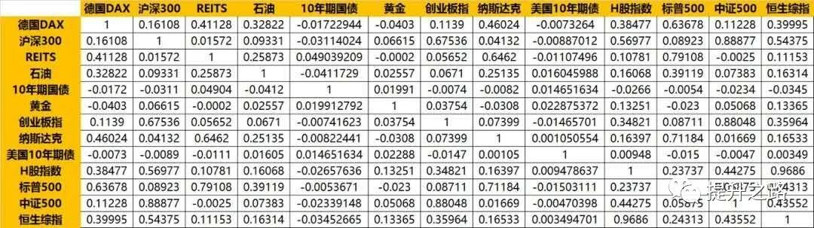

来源：ETF拯救世界，且慢，温故知新频道

E大发的主要是沪深股票交易市场的资产相关性。引用来源如下：
> 2006年至2014年，中国金融资本市场，可以在沪深交易所购买的金融产品相关度
公众号：长赢指数投资
2015年三季度金融资产配置建议

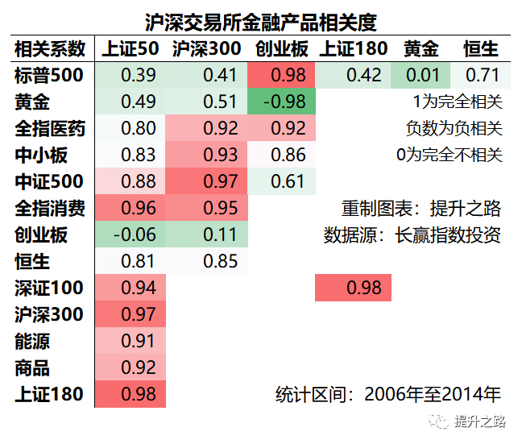
请注意！经过检索E大的所有文章，上面数据很珍贵，记得保存。邮件虽然推送有多次涉及，但不是公开平台。

且慢E大的两个栏目“E大问答”和“温故知新”，原先“E大问答”需在且慢有投资才可见，故且慢不被列为公开平台。今天用另一未投资的号看了下，两个频道均可正常观看。筒子们，记得去且慢app看E大的原汁原味文章。

除了上图（该数据2014年3月雪球首发，略有差异），雪球发过的另一张图，原图本身比较模糊。

来源：ETF拯救世界，雪球，2015年9月22日

### 1.5.2. 每种资产配比多少

有了相关系数后，我们知道尽量选相关性低，甚至不相关的资产来组建投资组合。但需要多少种呢？每种占比需配多少？下篇继续研读。

## 1.6. 资产估值

[研读丨ETF拯救世界：资产估值](http://mp.weixin.qq.com/s?__biz=MzIyODE3NDE4Mg==&mid=2649860519&idx=1&sn=ed610c7175f6e8e8d1734b928b379500&chksm=f050f9aec72770b8888470ed0b36faf9d7aa867c0c8bf46f0ac25b8294920ecc8908d82ee801&scene=21#wechat_redirect)

### 如何搭配

首先，尽量找出相互间相关系数较低的资产，先列出来。

>我的资产配置中，大致分成下面几个大类。  
A股、境内债券、成熟市场股票、新兴市场股票、境外债券、原油、黄金、房地产。
ETF拯救世界，E大问答，且慢

E大较少谈及房地产大类投资，本系列也无研读计划。接下来重点看下搭配其他几大类。

确定大类占比涉及一个估值的问题。比如A股在2006年6000点和在2018年的2600点，配置的比例能一样吗？

当然不行，**配置资产是一个动态的过程，需依据估值高低定期调整**。

### 如何估值

估值又怎么获得呢？这就是E大投资体系的核心了。
E大的估值体系

- 常用的PE、PB、PEG等，
- 还结合了纵向对比历史百分位、
- 横向对比各国各个发展阶段的差异，

相当复杂。

考虑到我们大多数情况下，吃大头就可以的情况下，我曾经做了简化尝试。

假定股市长期的驱动力是
**增长率 = 经济增长 + 通胀指数**

那么股市正常情况下是稳定向上的。
增长率就是下图的斜率，而真实的股市就在这个中轴线波动。

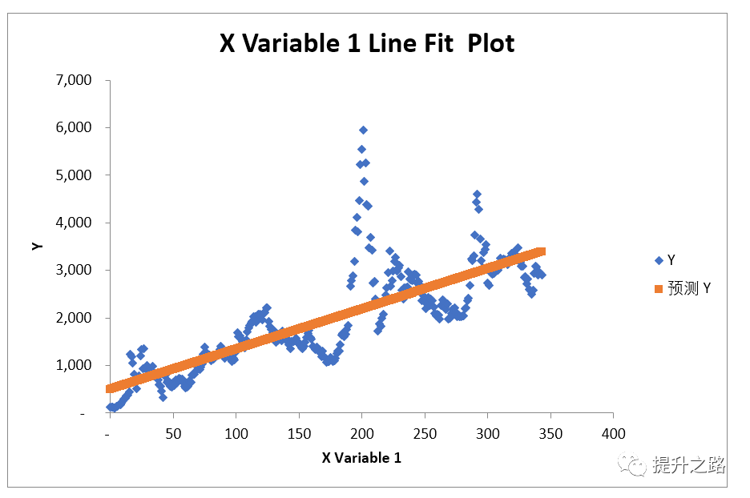

上图蓝色点位是上证指数按月实际点位，橙色的线可以认为是中轴线。
偏离中轴线越远，就说明回调的概率越大。

重点强调下，往下偏离从图中看可以看出低估区域，但往上偏离时，多么夸张都可能。
因此实际操作时是有区别的，后续研读趋势方法时再探讨。

接下来就是根据偏离度确认单个投资品的配置权重了。下面E大给出了一个建议：

>我们选用价值法配置权重：
找出历史估值中枢，在这个中枢布置50%配比，随着估值上升，配比下降，直至25%底线。
反之，随着估值下降，买入该类产品，直至75%上限。
公众号：长赢指数投资
2015年三季度金融资产配置建议

确定了每个产品的估值位置后，接下来就看各个产品组合到一起的配置了，下篇继续研读。

## 1.7. 资产配置

[研读丨ETF拯救世界：资产配置](http://mp.weixin.qq.com/s?__biz=MzIyODE3NDE4Mg==&mid=2649860573&idx=1&sn=51ae85a0270debef6e22e7ad50e25128&chksm=f050f9d4c72770c27d9d0c5fcbe83bf495f6c07757b8493b4aee69baa730bdc9f38d9fd53664&scene=21#wechat_redirect)

## 利用概率

>未来当然无法预测，但我们可以根据概率调整我们资产配置的比例。 某类资产风险较高，则可以适当下调配置比例。 我们不去预测风险，但我们可以计算概率。
ETF拯救世界，温故知新，且慢

学生年代，最讨厌就是概率论了，其他学科可算出一个确定解，为何到这里就变成不确定呢？毕业后，业余读了《上帝掷骰子吗》，而工作中的实际应用，才发现世界的运作更多的是概率的游戏。

比如2018年底，在公司内部交换礼物时，我送了一条策略，建议可以买点中证500，就是基于数据显示，中证500估值已经在历史最低附近。当时如果买入，大概率（比历史95%以上的估值便宜）可以在3-5年内，获得25%-30%的年化收益（数据如何得出，后续细讲）。

因此，当时的配置里面，中证500按目标占比，几乎可以配到该资产的最大份额。

## 目标占比是什么

考虑到分散投资，每个大类资产有一个最大占比。当该资产买入比例达到最大占比时就停止买入。主要为了防范单一品种波动，带来的全组合风险。

>国内股票（大、小）、境外成熟市场、境外新兴市场、债券、现金类、原油、贵金属、房地产、外汇。
在你的终极配置中，单个品种配置不要低于5%。 低于这个数字对你的资产组合没有意义。 然而也尽量不要高于20%，最多不能高于30%（如果你特别钟爱A股，可以把大、小股票分为单个品种，也就是不要多于60%配置）。
ETF拯救世界，温故知新，且慢

配置品种和目标占比，E大已经说了。下面我再放下他当前最新的配置情况。

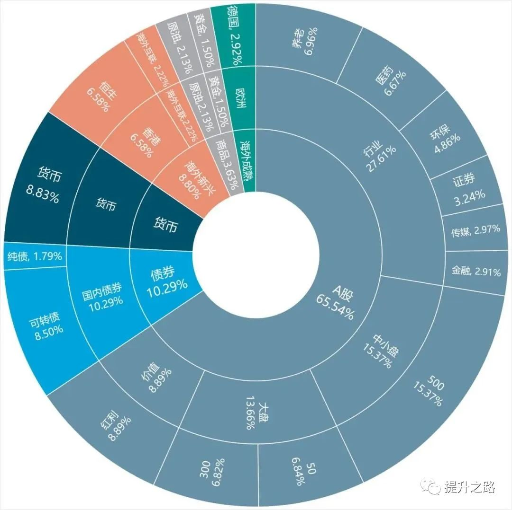

图片来源：ETF拯救世界，长赢指数投资

请注意！请注意！请注意！如果从零开始配置的，不可直接按上图操作。

时点不同，操作不同。比如占比6.58%的恒生，即便当前股市暴跌的情况下，E大已买的均价可能比当前还要低25%，主要因为2016年恒生指数跌到接近历史最低时，他买入较多。

如想跟E大车的，可以去且慢设置提醒，只有买入价格低于E大才提醒。操作就不介绍了，毕竟他们也没给我广告费Image。

嗯，接下来每个品种什么时候买入，就涉及建仓节奏的安排，下篇继续研读。

### 后记

刚购买数据服务，后续可做更多的数据分析了。比如大文豪曼因斯坦经常反驳的“央行放水”论，下图就可以看出究竟放水了没有，借用大文豪的原话：

>为此我特意翻了一下数据，7月份货币投放量为6200亿，而回笼量高达12000亿，货币净投放是负的5800亿！哪来的放水？好吧，是不是7月没放水，前几个月放了啊，好吧，我特意把今年以来的数据都拉出来看了一下。从一月到7月底，市场净投放资金为负的12000亿。也就是实实在在的从市场回笼了1.2万亿的流动性啊，你家放水是这么放得？
大文豪曼因，公众号：大文豪曼因斯坦
世人皆困于利，焉知天下之势

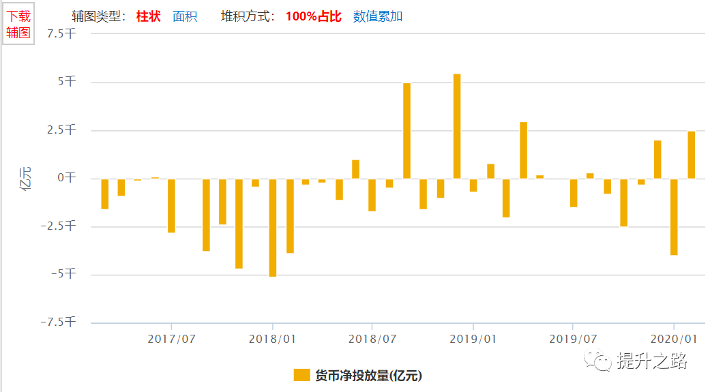

## 1.8. 建仓节奏

[研读丨ETF拯救世界：建仓节奏](http://mp.weixin.qq.com/s?__biz=MzIyODE3NDE4Mg==&mid=2649860686&idx=1&sn=cf4d017e45461a59114adec5061a5226&chksm=f050fa47c727735151326f7e6d212ca25792addf0e9fbd5ed58b83c1b5cb6c01b390c55fc2e9&scene=21#wechat_redirect)

### 时间与空间

>资产配置，不能天天盯着大盘追涨杀跌。要给出上涨或下跌的空间与时间。你才能在某类资产暴涨一段时间后，获利了结一部分，买入走熊很久的另一类资产。
>
>这个过程间隔不能太短，否则摘芝麻丢西瓜。三个月是最短，半年最好。我们选择季度，三个月。
> 
>至此，金融资产配置完毕。关上交易软件，专心去做自己的事。三个月后，打开潘多拉魔盒，继续收割与播种。
>
>公众号：长赢指数投资
2015年三季度金融资产配置建议

E大一直强调时间与空间的艺术。**时间指多久调整一次仓位，空间是指涨跌幅度多大调整一次仓位**。例如近期股市下跌，要留出足够的空间来买入，避免把所有子弹都打在同一区域。

>通过数据、情绪、政策导向判断底部后，进行仓位布局。 这里就牵扯到我一直说的节奏问题。 到了底部区域，你的节奏一定不能再继续慢慢买。 因为金融市场，极度高估和极度低估都非常罕见，一旦出现，必须大力买入。
ETF拯救世界，如何避免底部“吃不饱”，且慢

在2018年底，A股估值曾到过“钻石底”（E大的估值系统）。在极度低估区域，我快速布局了**沪深300、中证500和医药ETF**，这些是压舱石，准备长期持有。这两年结合波段策略调整，持仓成本已下降到相当于在上证2200点买入的。就是说，即便上证跌到2200点，已有持仓还是盈利状态。

**建仓标的\时机和位置都需提前准备好，一到目标位置，快速出击，完成布局**。

目标市值

还记得这图吗？蓝色的点事上证的波动，橙色的线是理想情况下股市的趋势。目标市值，对已有持仓的调整，就参考此类图表。

假定当前持有沪深300市值1万元，正常年化增长率7%（是假设，后续再提供所有指数历年年化参照表）。

正常情况下，1年后持有的市值应该等1万元*（1+7%）=1.07万元。如果1年后没达到，则加买入补齐到1.07万元；而超过了，则卖掉部分仓位，一样确保回归到目标市值1.07万。

至于多久调一次，上文E大已给了建议：三个月最短，半年最好。

上面既然谈到年化增长率，下篇研读下各宽基的数据。

## 1.9. 收益回测

[研读丨ETF拯救世界：收益回测](http://mp.weixin.qq.com/s?__biz=MzIyODE3NDE4Mg==&mid=2649860765&idx=1&sn=cd8f1712b68b083c61ffd599b0c41840&chksm=f050fa94c7277382301d97ffff210c4c204ada728c1efef2c6488156916d412b395ec6ef33ad&scene=21#wechat_redirect)

### 长期持有的表现

完成建仓后，当然希望大赚啦。之前的文章我一直说先胜而后战，接下来就来介绍如何做到先胜。

首先，指数是一堆股票的聚合。
依据概率论，每一个股的涨跌可能没规律，但很多个股一起，反映到指数就很稳定。只要表现时间足够长，就有规律可以参考。

下面表格是E大在且慢发的深成指收益统计，首次发布时间2017年12月07日。

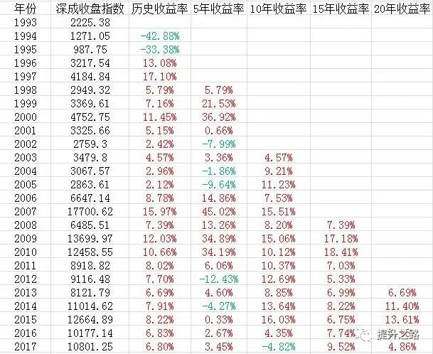

图片来源：ETF拯救世界，且慢

历史收益就是从1993年买入后，持有到哪一年的年化收益率。例如持有到1994年年化是-44.88%，持有到2017年年化是6.8%。

5年收益率则是持有5年的年化收益率。例如1993持有5年到1998年的年化是5.79%。而1994持有到1999年的年化是21.53%……以此类推可看10年、15年的年化收益率。

从表格可知：深证指数买入后长期持有，15年以上收益肯定正的，即便在高点买入（也正因高点买入的才需这么久才有正收益）。持有10年年化大部分落在10%-13%区间，取决于买入时的估值高低。

考虑到大家对上证指数更熟悉。下图是上证持有年份的年化收益率。

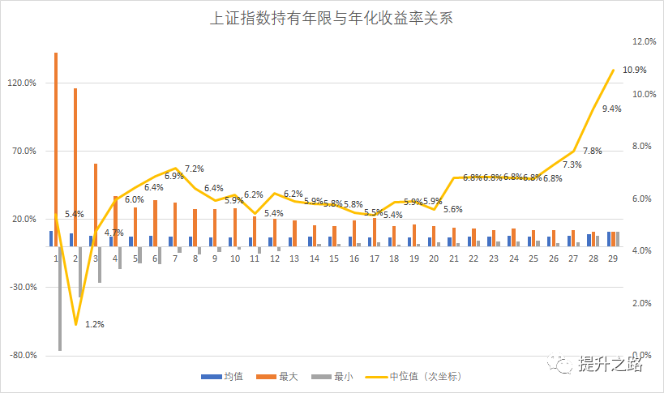

图表说明

- 坐标
  - 横坐标是持有年限，
  - 左纵坐标是波动幅度，
  - 右纵坐标是中位值。
- 柱图
  - 蓝色是买入后持有X年平均年化收益率。
  例如过往所有年份，买入持有1年的平均年化收益是11.7%。
  - 橙色是买入持有X年后最大的年化收益。
  例如持有1年最大高达142%，是1991年买入，持有到1992年的收益。
  - 灰色是买入持有X年后最小的年化收益。
  例如持有1年最低收益-76%，是2008年买入，持有到2009年的收益。

结论：持有时间越长，波动越小，最后收敛到7%附近。
就是说：上证的长期年化收益大概6-7%。

除了上证指数，补充E大最爱的中证500年化收益率

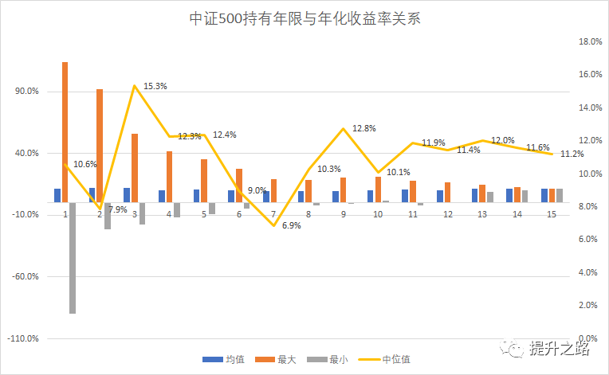

从上图可看出：**中证500长期持有的年化收益率大概10%-12%**。

类似这样的图，还可以做很多。比如美股已有百年历史数据，也是分析的绝佳素材。

### 后记-

有了这些数据，接下来就研究如何设定年化目标及动态平衡，实现目标市值了。

附表1：上证持有年限年化收益明细表

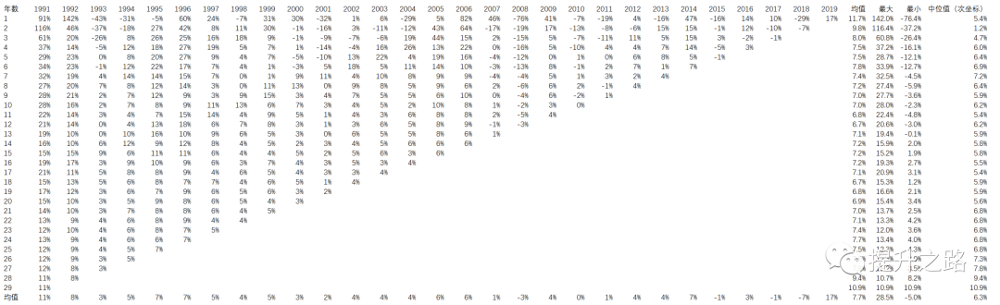

附表2：中证500持有年限年化收益明细表

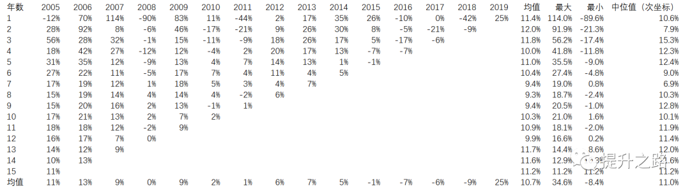

## 1.10. E大策略:目标市值

[研读丨ETF拯救世界：目标市值](http://mp.weixin.qq.com/s?__biz=MzIyODE3NDE4Mg==&mid=2649860854&idx=1&sn=7132aadba450c909f294b23ed89e471c&chksm=f050faffc72773e92a83a21415c403bd9be53beb4e06186be6d1a9f1b139affe41c1afd37e06&scene=21#wechat_redirect)

上篇研读了收益回测，**在此基础上可计算，已建仓品种在一段时间内的合理收益**。
目标市值就是基于年化收益目标，实现资产定期动态调整。

E大的三大策略之一。原本考虑该策略只在邮件同步，不便公开分享研读。整理E大博客（一个经济观察者的自我修养）时，发现在2013年E大有公开分享过，因此有这篇的公开研读。

### 什么是目标市值

目标市值法，我简单阐述一下。

对于消费这样的，预期将必然长牛的行业，个人认为比较适合目标市值管理法。

这个方法简单来说，就是先设定一个目标收益率，计算出目标市值，然后定期纠正现实市值与计算市值的差异。

举例来说，买入10万消费etf。预期年化10%。这样，半年收益率简单计算应该是5%（不考虑复利）。那么半年后这10万元应该增值到105000。

当然，到时候市值绝不可能正好是105000。那么，如果到时候市值跌至90000，就买入15000元，补足105000的市值。相反，如果到时候市值到了110000，就卖出5000元，将市值拉低到105000。

ETF拯救世界，公众号：提升之路
转载丨消费ETF已入仓位配置

### 模拟操作

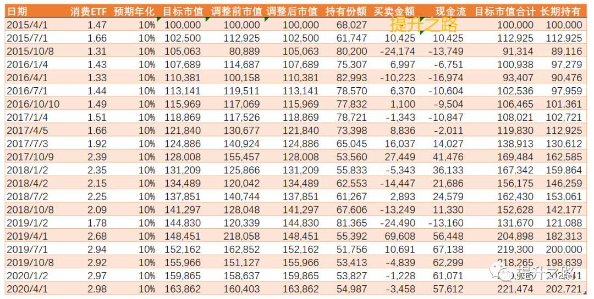

假设按正常情况下，消费预期年化收益10%，按季增长则是2.5%=10%/4（简单算法，实际年化复利有差异，这里可忽略）。

2015年4月1日，买入100,000元消费ETF，净值1.47，持有份额68,027份。

到了7月1日，100,000元应该变成102,500元。此时净值升到1.66，市值是112,925元，则需卖掉10,425元，保证市值还是102,500元。这时手头就持有61,747份ETF+10,425元。

到了下个调整日，这时净值跌到了1.31，市值只剩80,889元，这时需补24,174元才能达到目标市值105,063元，调整后持有80,200份，另外除了把上次的现金补仓外，额外又多了加了13,749元补仓。
……

经过不断的调整，到了今年4月1日，这时持有ETF市值是163,862元，同时持有现金57,612元，合计是221,474元。而假如当时买入后不调整，则当前市值202,721元。

**总体收益多10%左右，但持有25%左右的现金，假如接下来有下跌还可补仓，因此肯定比单纯长期持有合理。**

### 还需注意什么

>这样做的依据是，这款产品的市值按道理应按照某种斜度（也许10%、也许9%或11%）线性增加。在理论市值上下，低买高卖，最终实现资金管理收益目标。
>
>根据历史数据倒推，这个方法收益还算不错……
>
>这个目标市值计划，非常适合消费与医药行业。并不适合周期性行业。
>
>ETF拯救世界，公众号：提升之路
>转载丨消费ETF已入仓位配置

预期目标年化：可参看上篇收益回测，后续我有空更新更多指数

品种选择：长期趋向向上的指数，不适合个股，不适合周期指数，比如证券。

### 后记--

目标市值后续E大做了优化，因暂未公开分享，故不公开研读。下期研读E大三大策略之网格。

## 1.11. E大策略:网格

[研读丨ETF拯救世界：网格](http://mp.weixin.qq.com/s?__biz=MzIyODE3NDE4Mg==&mid=2649860898&idx=1&sn=037fd4a77e43c8b49e755ddecb21abfd&chksm=f050fb2bc727723d1599b1de031886bb3a566adeccb1c7e442f694072c100da0249b8a505bba&scene=21#wechat_redirect)

### 什么是网格

**目标市值策略主要面向长期单边向上的市场。**比如下面这种，可以在保证拿住仓位的同时，动态调整，达到既拿住底仓，又高抛低吸。

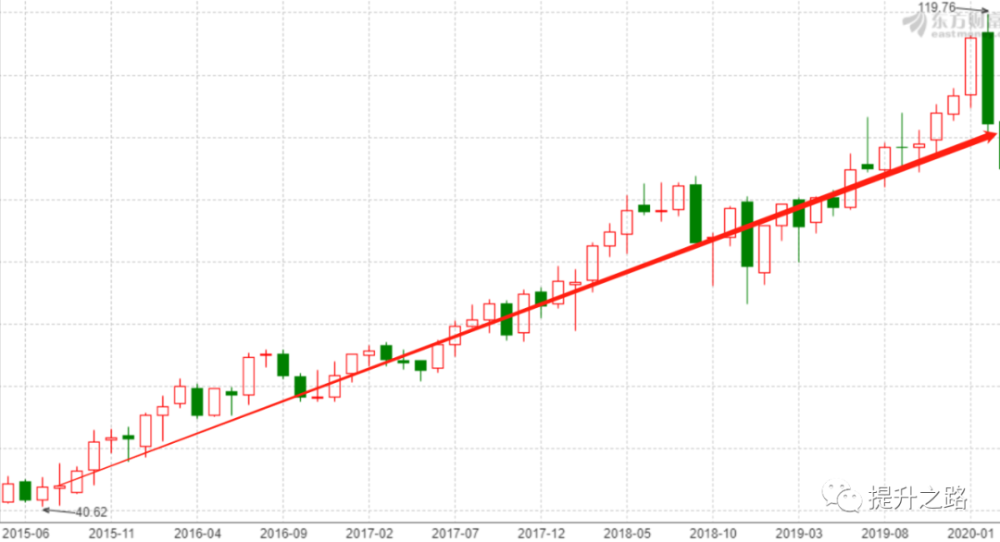

**网格策略则是面向短期处于低位的震荡市。**
比如下面这种，2年内大部分时间都在一个比较窄的区间波动。

网格就是在这种无聊（boring）的市场中，保持良好的心态。特别是对有频繁操作冲动的朋友，可以用来解下“买卖瘾”。

### 如何选品种

>你要做网格的品种，一定是有底的品种。也就是说，不会死的品种。这句话是你在这篇文章中需要牢记的第一句话。
>
>ETF拯救世界，公众号：长赢指数投资
>波段策略.网格之二：网格策略基础/1.0版

这里分享E大的一小段，强烈建议阅读原汁原味的E大原创文章。

个股不适合做网格，股票可能会死。期货也不适合，换仓及交割成本太高，如果遇到某行的原油产品，这次不单血本无归，还欠巨额债务。所以选择网格品种要牢记：谨慎！谨慎！再谨慎！

### 什么时候开始

>很简单。设计交易表格的时候，根据具体情况，模拟最大下跌幅度。比如说，你现在要开始一个中证500的网格，那你就应该知道，下跌60%，几乎一定是最坏情况了。甚至下跌50%也非常困难。那么你如果相对来说激进一点，就可以以40%设计压力测试。保守一点，就按照50%或者60%设计。
>
>ETF拯救世界，公众号：长赢指数投资
波段策略.网格之二：网格策略基础/1.0版

下图为例：
每格波动幅度为5%。假定A品种跌到历史最低点需跌50%，则就是图中的N列，对应图中标记为10的点(3.285)。这样从E列的5.973到5.674这样按100%，95%，90%……设置点位。

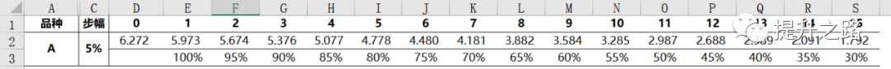

操作就是5.973买入1份，涨到6.272卖出；
或者没涨而是继续跌到5.674，再买入1份，合计2份。
5.674买入的在涨回5.973的时候卖，5.973那份在6.272时卖，其他同理。

另外，幅度设置太小，会导致赚的钱还不够交易费用的损坏，需平衡好。

下图就是某个品类我近期的网格结果，可以看到一直在某几个点位来回收割。

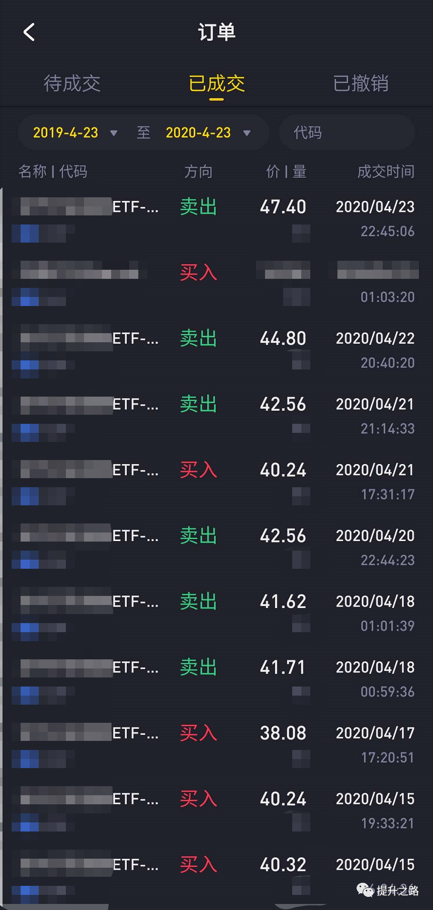

### 后记---

网格E大的写得很详细，本次先列最简单的。这里需反复强调的是，切切要足够低才可以使用此策略，不然如果在山腰做网格，一个下跌就把之前的利润全部吞噬，压力测试要留足够安全垫。

另，品种以E大罗列的为主，但假如阅读他过往的文章，可能有提及华宝油气和纸白银，但目前他在微博最新的同步是这两种暂时不适合操作。研读时需留意，切勿刻舟求剑。

## 1.12. 套利

[研读丨ETF拯救世界：套利](http://mp.weixin.qq.com/s?__biz=MzIyODE3NDE4Mg==&mid=2649861086&idx=1&sn=1062915aecd7c4e6e6e4dacf92fce2fc&chksm=f050fbd7c72772c1a50c18e8f3135f82e4cd1d629de1f4c04cc5dc682289184136b8e37d01aa&scene=21#wechat_redirect)

### 套利是什么

>一个品种，在两个市场上交易。两个市场价格不同，你就可以在一个市场上卖出的同时在一个市场上买入。这就是基本版的套利。套利还会有很多衍生策略，有空慢慢说。
>
>ETF拯救世界，公众号：长赢指数投资
持仓品种转托管的方法

小K看到村头白菜卖2元/斤，到了村尾发现同样白菜，卖3元/斤。小K赶紧从村头买白菜，到村尾倒卖。一转手净赚1元/斤，这就是套利。

利用不同地区、不同时间或因信息差异，赚取同一物品价差。

>空仓一周，出去办事。
周五回来，发现无风险套利机会，慢慢买入。
今天打开大智慧复盘，越看心里越惊讶，越看越...
下周一定会暴跌，股市继续漫漫熊途
好在我是空仓，暴跌更是给了我继续迈入套利的机会
>
>ETF拯救世界，网易博客，2006-06-17

从收集的E大文章看，他在2006年已经开始做套利了。后面的文章除了邮件，比较少谈及。做套利的人多了，套利的机会就会消失。

比如以上的案例，很多人都到村头买白菜到村尾卖，两边的价差就会慢慢消失。

### 哪些品种可做

常见的有LOF基金场内场外套利，期货的期现套利，可转债套利，分级基金AB份额与母基金套利等等。

比如前段时间石油大跌，国内很多交易者争买石油基金。而基金公司因外汇额度用满，无法继续在国外买入，暂停申购导致大幅溢价，这里就有套利机会了。

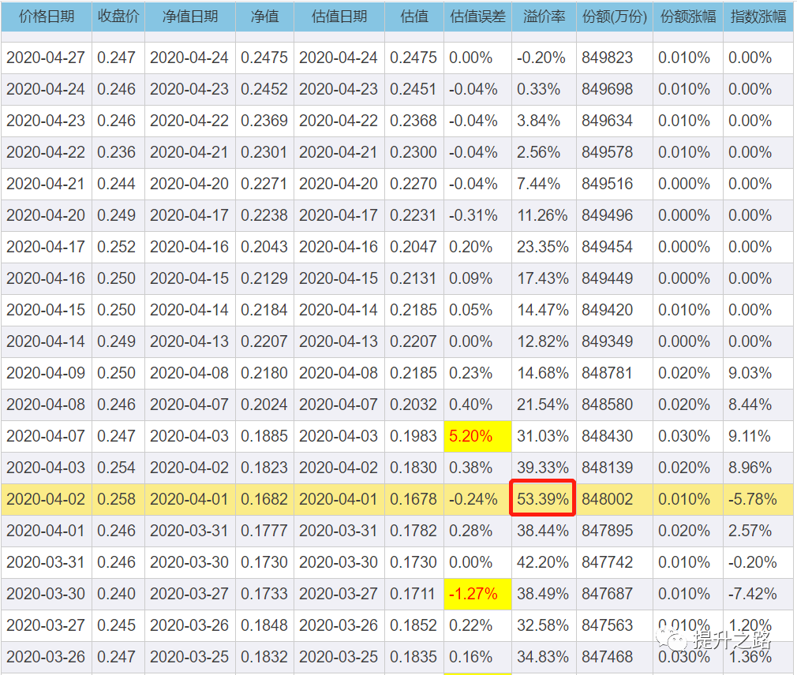

比如某只油气基金，4月2日溢价率竟高达50%以上，如果当天卖掉该油气基金，同时有外汇在国外买入跟随同指数的孪生姐妹基金，就可套利了。

下面是当时跟朋友的聊天记录：曾经有一份日赚50%的套利摆在我面前，我有好好珍惜！

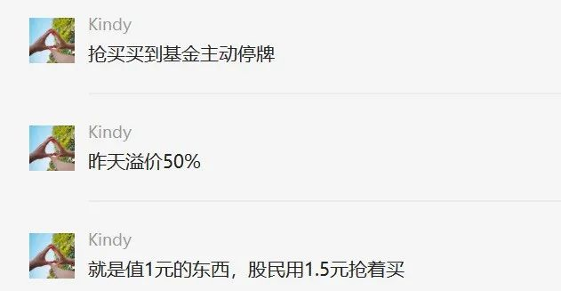

### 哪里看套利机会

集思录有页面可以看：<https://www.jisilu.cn/data/qdii/#qdiie>

实际套利还分很多种玩法，防守型和进攻型，同理，折价也可以套利，以后有机会再继续介绍。

### 提示

E大微博名：ETF拯救世界，微信公众号名：长赢指数投资。有好多山寨号，注意区分。

## 1.13. 比特币

[研读丨ETF拯救世界：比特币](http://mp.weixin.qq.com/s?__biz=MzIyODE3NDE4Mg==&mid=2649861316&idx=1&sn=e331592ff016b7afde8e586dc8f43fc8&chksm=f050fccdc72775db3ec7ffb331e5fefe7ca8e0dd6b3e59371ed11c3bc890a0cd44c6ac0bb2f6&scene=21#wechat_redirect)

本文整理E大过往对比特币的表态。

### 正文

从我收集的资料看，E大最早谈及比特币是2016年8月1日的邮件，之后还有4份邮件论及。鉴于后面公开论述跟邮件意思一样，往下看即可。

公开场合讨论首次是2017年9月22日的微博，讨论能力圈谈到“比如说，融创或者比特币。就是涨一万倍我都毫无感觉。因为那是不可把握的，是自己能力圈之外的”。

2018年1月3日，在雪球跟粉丝讨论高风险、低风险投资品时，说“比特币，黄金，还是石油？后两者可以放入我们的组合，但不能是主要配置。至于前者，其它的单说，我都不知道哪里可以合法的买卖”。

2018年2月26日，补充“我确实不能100%确认比特币不会死。90%也不能”。

2018年4月4日在雪球讨论“投机品”时，E大说“比特币我也没赚到。但是我会学习和反思，看看整个过程中是否有值得学习的地方。”

2018年6月13日在雪球谈及他之前的理论：“不会死的品种下跌80%一定是铁底”。当时他认为，比特币最高点19299（原话），铁底应该是3800。上一轮下跌最低点接近3100。

但是！他接下来强调“即使到了，自己大概率是要怂，不敢抄的。第一，我不知道它会不会死，第二，更重要，我不知道怎么合法的买……”。

2019年6月27日在微博评论交易平台出问题时说“我怕的就是这种。如果不会有官方交易平台出现，那么什么时候比特币能够去中心化，能够随意在玩家之间安全交易，我才会考虑。民间的交易平台就算了。”

### 结论

综合邮件、雪球、微博的比特币观点，汇总如下：

- 投资要在能力圈范围内，不懂可以研究
- 好的投资品需法律保障，有监管
- 比特币没有保障，无法确保不死，不想碰
- 不在于是投资还是投机，而是否被骗

基于以上原因，E大没有投资比特币。

## 1.14. 心态管理

[研读丨ETF拯救世界：心态管理](http://mp.weixin.qq.com/s?__biz=MzIyODE3NDE4Mg==&mid=2649861589&idx=1&sn=21099c1173622f940f372cd8c006ec6f&chksm=f050fddcc72774ca7cbbc9c242415527f34c2da80b06fcf51116c0c214ec5f91e450eaece94f&scene=21#wechat_redirect)

E大在评论股市时，喜欢用的口头禅是**“多大点事，踏踏实实的”**。我觉得用在当前的A股心态也是适用的。本文研读E大对股市的心态管理。

### 正文+

首先，我们的投资更多不是“炒股”，而是“资产组合配置”。无所谓的追涨杀跌，而是基于估值的资产配置。

就像我们拿着现金，提着篮子到市场闲逛，看到什么便宜就买进放入篮子。等很多人抢购时，就把低价卖的东西卖给抢购的人。

我们自认为凡人，无法预测股市短期走势。对应的策略是在估值偏低时候默默买入。

经历过2015年底恒生严重低估的区域，那时市场流行的话是“港股边缘化”，恒生指数被弃之如敝履。当时我跟着E大不断买入，最后成为我组合的第一重仓股。

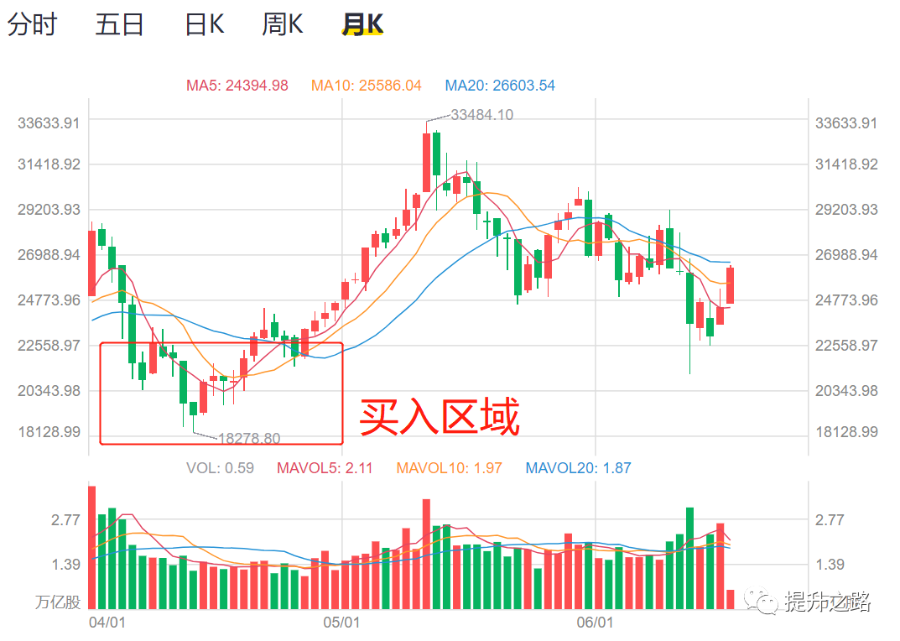

随着2016年的港股回暖，我便迫不及待地猜顶卖出，在不断被打脸的过程中逐步丢失了大部分筹码。同期E大做了目标市值，稳稳的拿着并不断微调持续至今。从那时我学会了**“让利润奔跑，趋势转变时止盈”**的心态。

E大经常喜欢引用《史记·货殖列传》的**“旱则资舟，水则资车……故人弃我取，人取我与”**。

接下来自己除了正常的资产配置外，有两次活学活用“人弃我取”的例子。

2018年低的中证500，当时在历史次低（最低是2008年金融危机）的位置买入。这个案例老粉应该都知道，是2018年圣诞节部门交换礼品我送出的一条策略，文章《再见，2018》可查。

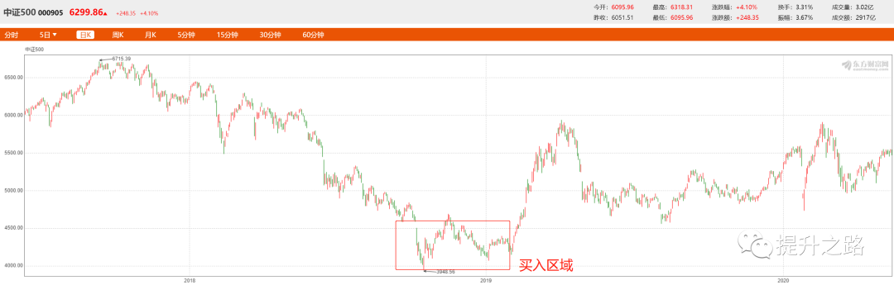

另一个就是医药，可能就比较多同学知道当时医药暴跌的背景了。很多公司财务造假，又逢国家出台“带量采购”政策，很多药品入医院价格只剩原来的不到两成。在这种情况又出现了难得的估值大坑。

自此，我是E大坚定的粉丝。遇到愿意交流的朋友，在公众号都愿意跟大家推荐E大。

建议对投资不了解的朋友，先调整心态。别人研究十几年的东西，怎么可能你赶在牛市开始后就会。先踏踏实实，从最基本的了解学习，有的是机会。

最后，贴E大微博对于牛市的评论：
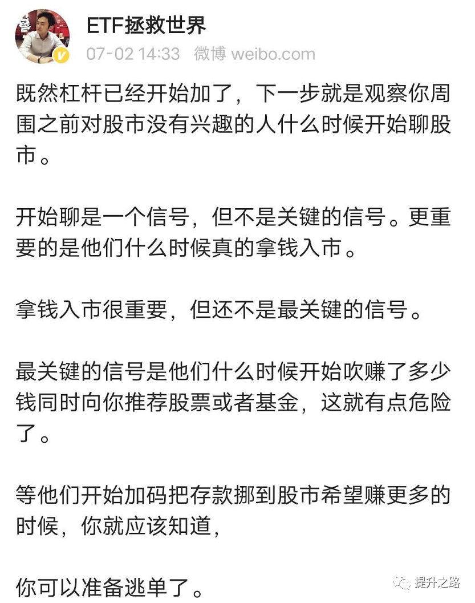

### 后话

E大微博：ETF拯救世界，有30多万粉那个。
E大公众号：长赢指数投资。

另，最近有新朋友连续留言问是否牛市开始了？我回复：不知道！我真的不知道，我不是神棍。

还有，现在的走势是否跟大文豪曼因斯坦的观点是否冲突。我在一个月前的文章《闲聊丨投资的确定与不确定》已说过了：

## 1.15. 刻舟求剑

[研读丨ETF拯救世界：刻舟求剑](http://mp.weixin.qq.com/s?__biz=MzIyODE3NDE4Mg==&mid=2649861762&idx=1&sn=abdb02253da8c8662386f69500685cfd&chksm=f050fe8bc727779d5345b747c122b234c9b9491e3d3c067ebe2ca44e32a4bed35d11ab356a4b&scene=21#wechat_redirect)

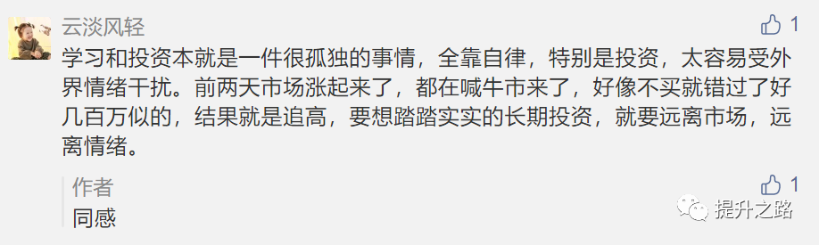

今天借用“云淡风轻”的留言作为开头。

为何写本篇？主要是对E大计划的一些反思。古人说“尽信书不如无书”，指读书不要拘泥于书上或迷信书本。

对于认同甚至追随E大的朋友来说，E大说的当然是重要的。但各人的投资经验不同，资金实力不同，家庭情况不同。

E大肯定无法面面俱到，所以参考他的计划，也需防止“刻舟求剑”。在投资学习深度足够的情况下，可以适当做些调整。

### 150计划

关于E大的第三轮150计划，个人做些调整。（仅作为个人思考及操作，并非推荐大家同样操作，请留意！）

#### 场内操作

在合适时，我是有加杠杆的计划和策略，而目前好像只有场内才能两融（融资融券）。另一方面，场内方便我做一些临时操作，后面会讲到。有些实战场内没有替代的，才用场外的，比如养老基金。

E大考虑场外操作，主要是跟车的资金太多了。每次开车都导致一些基金溢价太高，自己人相互踩踏，反而给一些人有套利机会。

#### 聚焦种类

E大研究比较深入，他会把握不同种类的最佳时机，类似中证500以及中证500增强，在不同时点会采用不同策略。但对我而言，我在设计基于E大思想的体系，一开始无法面面俱到，所以我会有意思的先抓大放小，聚焦几大类，比如沪深300、中证500、创业板、消费、医药、养老等几个宽基+几个主题。

#### 结合趋势

在150份里面，有些因为跟车太晚，无法买入导致一直没买满。我的策略是底仓跟E大，缺少的部分用趋势交易方式买入。具体就是当右侧趋势信号出现时，我就捏着鼻子把没满的部分补齐，趋势转下跌时，卖掉因趋势交易时买入的部分。

这个操作使得我在2800点左右仓位一下从30%升到80%以上（因为后面资金变多，很多无法补齐导致仓位偏低），总体跟上了这一波上升。接下来就等趋势变差时，把多余的仓位兑现离场了。当然，这部分也做好的趋势交易在震荡市被反复打脸的准备。

#### 刻舟求剑

对于E大的计划，里面有些可能也需了解逻辑及根据情况微调。
比如恒生指数，E大在2016年恒生指数低点买入了大部分恒生仓位。
E大在且慢跟车有个触发条件是必须比他买入时的价格更优才提示买入。这是他一片好心，希望大家买得更低，也避免给他抬轿之嫌。

但如仔细观察，可以发现E大历次开车，一般都精准踩点，后面要抄E大的底真的很难。还有，四年过去了，恒生的最低估值区间对于的点位肯定一直上移的。意味着，假如之前E大买在低点附近，现在目标低点已经上升了，你还想买得比E大四年前低，根本就不可能了。

因此，我作了些调整。在3月恒生指数暴跌时，估值百分位已接近历史最低时，迅速补足恒生的仓位。

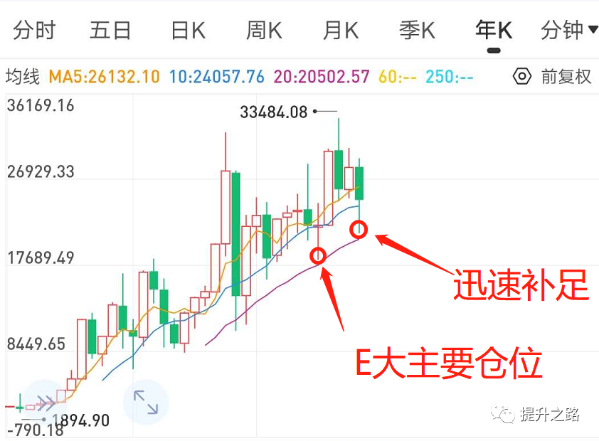

以上一些思考主要抛砖引玉。希望大家一起思考如何优化自己的策略。因为是思考，有错的地方还望大家指出。

## 1.16. 金银比

[研读丨ETF拯救世界：金银比](http://mp.weixin.qq.com/s?__biz=MzIyODE3NDE4Mg==&mid=2649861795&idx=1&sn=1a2cc05822fe55f311fac4910db3a484&chksm=f050feaac72777bc6a54254c081901bd23fac2963842343d3c2ce0113848be95d28465ccefb8&scene=21#wechat_redirect)

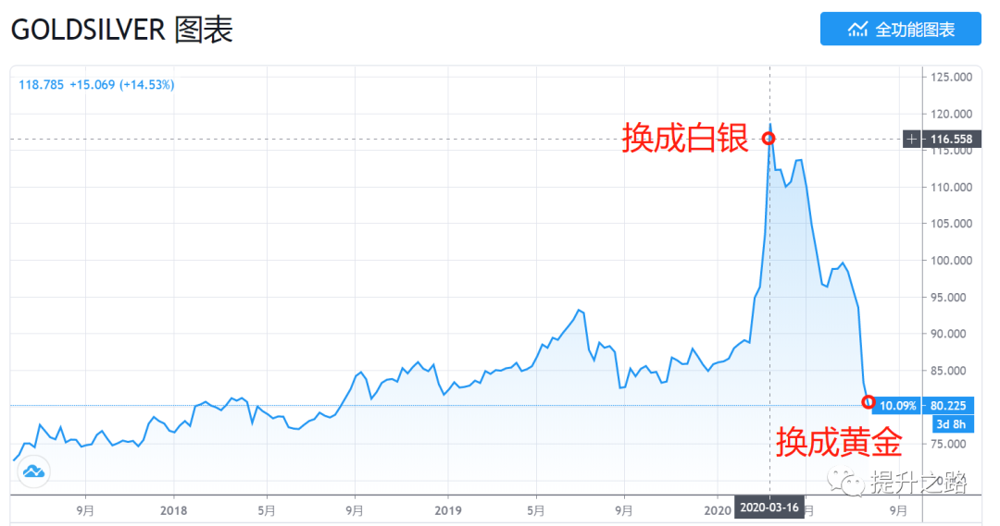

还记得《复盘丨遇见大时代》一文说的：黄金和白银在116时也完成了换仓。

最近金银比回到了80左右，我把大部分本该是黄金的仓位，在3月被换成白银的那部分，重新换为黄金。原属于白银的仓位继续保留白银配置。

这个操作可以认为是跨品种套利。套利的简单介绍可以看下《研读丨ETF拯救世界投资：套利》一文。

本文主要分享金银比投资的一些想法供探讨，不作为投资建议。

### 黄金白银收益情况

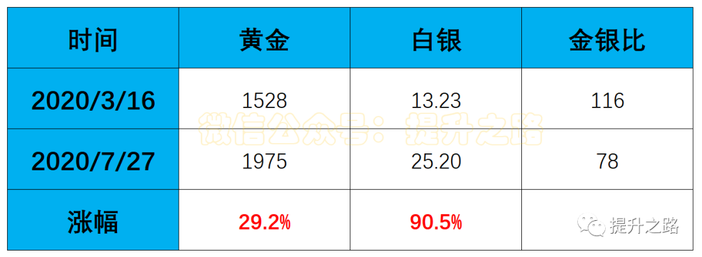

上表显示3月16日截止昨天操作时的黄金和白银情况。

从表格可以看出，大家这段时间一直讨论黄金猛涨，实际3月至今也就涨了29%。而同期白银涨了90%。也就是说，如果我3月还拿着黄金到现在只赚29%，但切换到白银后，我赚多了不少。

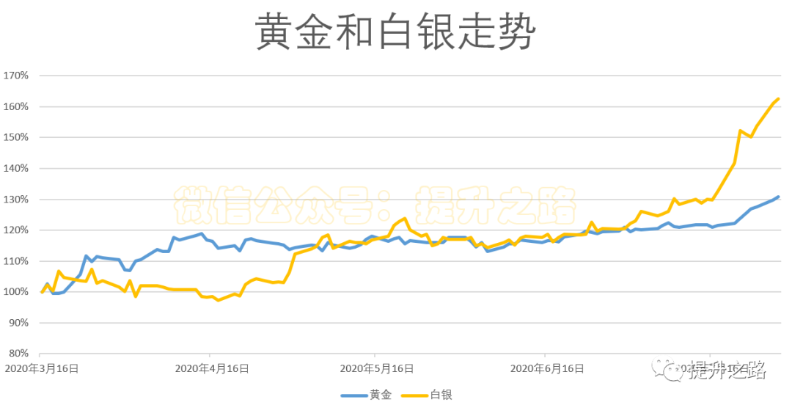

从上图可以看出，3月16日至今的黄金和白银走势。我切换后，黄金仍继续上扬了一段时间，然后白银迎头赶上，在纠缠了一段时间后，白银就策马扬鞭飞奔而去了。

### 为何看金银比

黄金白银可以相互换仓套利，是基于历史上两者走势相关性比较强。

我们假定两者的价格比例是恒定（在一个区间内），那么两者如果偏离这个区间，有时就是黄金贵了，有时就是白银贵了。

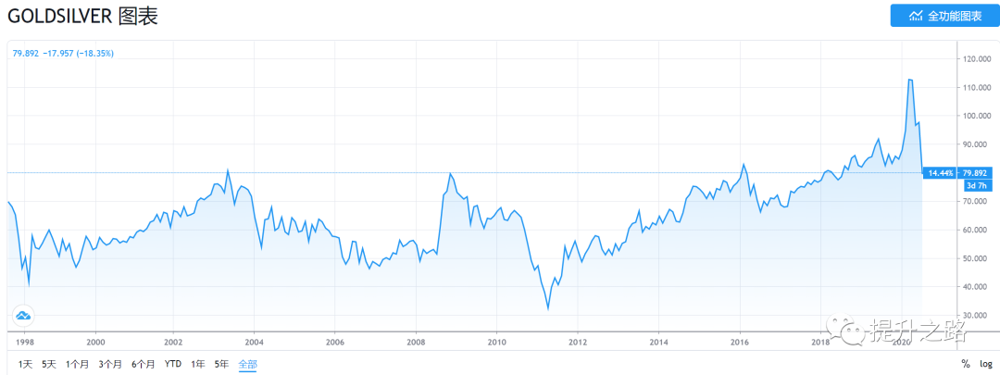

上图可以看1998年至今的金银比。

从长期看，目前仍在黄金相对白银偏贵区间。而我因为本轮操作已到达自己的目标，所以不会等2011年那种低点切回。踏踏实实的，多大点事，舒服最重要

E大的邮件有提供几个范围作为参考，这里不提供，大家自己看图做作业吧。通过上图大家也可以大致看出，我的这次操作跟E大划定范围可能不一致。具体一些不同的想法，可以从《研读丨ETF拯救世界投资：刻舟求剑》获得。

### 需注意什么

指标只用于手里有黄金或白银仓位时，内部两者品种的互相转换，达到套利目的。

请留意！不是用于指导买入或卖出黄金或白银！

## 1.17. 三观超正

[研读丨ETF拯救世界：三观超正](http://mp.weixin.qq.com/s?__biz=MzIyODE3NDE4Mg==&mid=2649861960&idx=1&sn=1b64ab999a78f1c15c6e1772f02c7a9f&chksm=f050ff41c727765734dfb136680afcd98a257d22b990037bc3dc18fe8b9d5ab72d47aa74b175&scene=21#wechat_redirect)

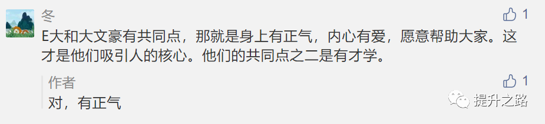

朋友「冬」留言提及E大（ETF拯救世界）和大文豪「身上有正气」。正因为如此，我才愿意研读以及推荐这两位。

今天就聊聊E大的三观吧。

### 01 三观正

我每次遇到新朋友，都会观察至少半年以上。只有三观正的，才愿意深入交流。

自2005年开始，从网易博客、雪球、微博、微信公众号，甚至邮件等，E大的信息都公开可见，因此有足够的时间可判断。

他是一个「三观超正」的人。

最近他在微博上谈到做人，我深感认同，摘录如下：

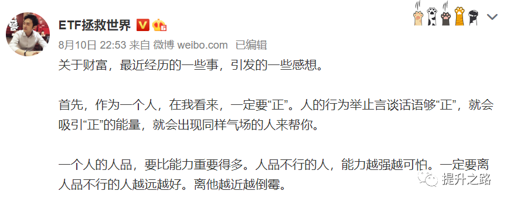

### 02 有爱心

从过往的记录看，他持续有做慈善。有捐过山区小朋友、「爱佑未来慈善基金」、「春苗儿童救助基金」等。

我希望这方面也能学习E大，当然能力有大小，量力而行。

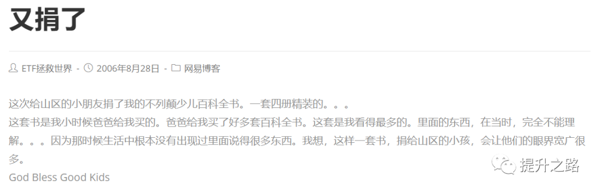

### 03 能坚持

最近有人问E大如果大家都用公布的这套东西，会不会导致市场不会再有极度低估和极度高估？

E大借用电影「闻香识女人」的台词回复说，市场整体并未有什么改变。原因很简单，很多人知道正确的路该怎么走，可从来没走过，因为太难了。

自我评估一番，发现自己也没啥特长，唯有选择难走的路，坚持下去吧。

## 1.18. 无聊的投资

[研读丨ETF拯救世界：无聊的投资](http://mp.weixin.qq.com/s?__biz=MzIyODE3NDE4Mg==&mid=2649862070&idx=1&sn=ad6ae1f69276a9a6c1bfb9c294eb989d&chksm=f050ffbfc72776a93877e521cfeb6bef77077a74ffd3a321727de2c60ed981d475a8c3b1f185&scene=21#wechat_redirect)

8月15日E大的公众号（长赢指数投资）最新文章也提到：金融投资大多数时间是无聊的。

### 01 潜伏在草丛中的狮子

除非高频交易者，大部分的市场的确是这么无聊。有机构统计，投资收益大部分来自关键的几个交易日。（我记得论点，但来源一直记不太清楚，有记得的朋友提醒我下哈）

早在2007年，E大的博客（一个经济观察者的自我修养）就论述的这个理念（经网友提醒，来自赵丹阳的文章）：

>我们不轻易投资，我们拥有足够的耐心等待理想的价格，就象潜伏在草丛中的狮子静静等待最佳出击时机一样。我们宁可错失，绝不冒进――在资本市场里，“活下来”永远是第一位的，我们象珍惜自己的生命一样珍惜自己的本金。控制风险是一切投资的灵魂。

正因我们需等理想价格才出手，所以大部分的交易时间都是很无聊的。

### 02 努力工作是正道

E大文章提到：

>现在就是交易的无聊的时间。波动不够大，波段也没得做。长线更不用说，上面表格中的利润率加上不断再平衡，会让你感到极度舒适，这时候更没什么好做的。那么无聊的时候，好好去努力工作或者风花雪月啊，大把的青春别浪费呀。

对大部分人来说，首选要承认自己就是普通人。**投资是寻求资产保值前提下的增值**。

不要幻想通过某次投资就一夜暴富。先踏踏实实的把力所能及的工作做好，尽力做大本金。

假如本金就几千或几万元，即便翻倍又能增加多少财富呢？

## 1.19. 有关邮件

[研读丨ETF拯救世界：有关邮件](http://mp.weixin.qq.com/s?__biz=MzIyODE3NDE4Mg==&mid=2649862171&idx=1&sn=1b294910d6b9fd65318fd8d55c48fed0&chksm=f050e012c7276904b1a91eb92d3a8ae058cd377f3972eb88c499d3bf156e4e0de298dc2e5563&scene=21#wechat_redirect)

### 致歉

8月31日，E大放开付费邮件申请入口。我太激动了，马上发文通知大家订阅。E大在9月8号邮件中提到：以后订阅窗口打开的时候，不要在群里宣传。

主要原因是，宣传后太多人订阅，但有些人明显不适合订阅，还有人看了后马上退订。过去几年看完后退订的总人数，还没那几天退订的多。

我通过微信，以及这里向E大道歉：因人群涌入及退订，导致占用E大的时间，我为此感到不安和歉意。虽然本号只有2000人关注，但或多或少肯定增加E大工作量。我后续将不再公开订阅入口信息。

### 缘分

有些人不珍惜，或者没意识到邮件的价值。这里我也聊下跟E大邮件的一些往事。

2015年股灾后，E大在分级基金一战成名，我在雪球关注了他。当时我一直在探索评估市场高低的方式。正好有一天，他提到要购买数据，众筹后把加工后的估值分享出来。

这正是我想要的数据呀，所以我第一时间就订阅了。据@刘杨宇同步，E大邮件开始于2015年7月份。而我开始订阅是2015年10月。

当收到第一封邮件的时候，我感动的要哭了。因为按原来说法，就只提供数据嘛。但实际上，E大除了给数据还做了点评。那段时间，几乎每个交易日，都有详细点评。

就这样在E大的不断「心理按摩」下，我的投资理念和投资框架才逐步搭建起来。我才慢慢理解那句话：踏踏实实的，多大点事呀。

我对E大，除了感恩，还是感恩。
关于邮件，正如他说的真正需要的&有缘分的朋友，自然加入就好。如果还有意向的，自行去E大的公众号尝试，方法见8月31日的文章。后续我不就不单独发文提醒了，容我「闷声发大财」哈。

祝大家好运

# 非系统阅读笔记

### 避开损耗

E大（微博：ETF拯救世界、公众号：长赢指数投资）之前在微博、雪球以及邮件，均多次提到长期投资要避开有损耗的品种。最近E大投资研究群里，有朋友提到一些品种有涉及损耗，这里整理下给大家汇报。

#### 为什么要避开损耗？

假如买了某期货品种的基金，该品种价格长期不变，但该基金的净值却一直下降。就是说即便价格无波动，基金还跌了，就是损耗影响，当然要避开。

#### 为什么会有损耗？

移仓损耗。移仓换月过程中就存在交易成本——期货手续费，且这期间还会有升水、贴水的影响，徒增成本。导致即便跟踪品种价格不变，而扣除损耗后基金的净值下降。

#### 哪些品种有损耗？

E大提及过的有：白银（161226）、南方原油（501018）、纸原油等

部分E大语录原文：
> 白银不要玩场内的161226，损耗太高。黄金用518880倒是可以。 
持有期货品种的基金不可以买，比如南方油，比如226。长期损耗让我们根本无法长期持有。
我们不能选择南方油等投资原油期货的品种。长期损耗太大。不适合计划持仓。
>
>再说一次，不要做这种有损耗的品种。因为时间不是你的朋友。比如白银基金，比如南方原油，比如工行纸原油，都不要碰。
>
>工行的原油损耗极大，无论多空都不建议买。纸黄金纸白银稍好，但个人还是上面的观点，做空，一定要非常谨慎。尽量让持有的品种做时间的朋友。
>
>我个人对期货品种一直是比较敬而远之。总体的原因就是损耗过大，不能算是“时间的朋友”。
>
>纸原油和纸白银不是一个概念，纸原油的损耗非常大，所以绝对不推荐购买。

目前要清楚的是
**购买基金完整流程中的损耗**