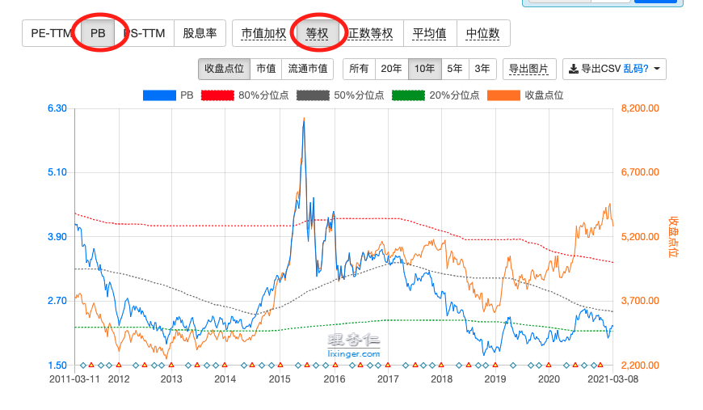
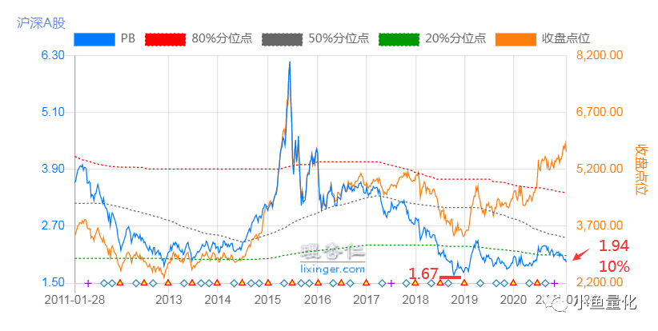
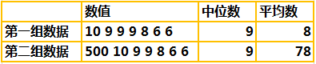
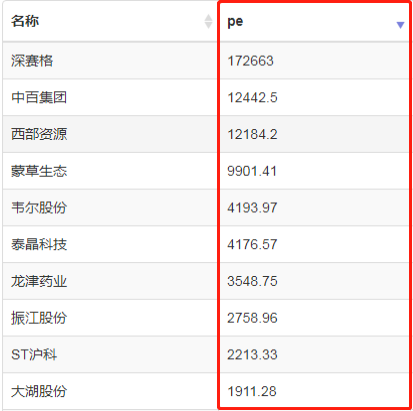

全市场等全 PE/PB

用全市场的PE/PB对整个市场估值，最能准确反映全部市场的情况。

## TODO

继续阅读 E 大的发车感言，根据他透露的参数，来比对数据

特别是黄金坑等几个点位

## 图形参考

参考理杏仁的[沪深A股1000002.lxr](https://www.lixinger.com/analytics/index/lxr/1000002/1000002/detail/value?granularity=y10&y-axis-left-metrics-name=pb&metrics-type=ew)

## 1. 结论：全市场等权中位数PB

小根据E大的一些公开文章和资料，对黄金坑和钻石坑进行了定义：

### **黄金坑**

**全市场等权PB在2.2以下**；

2018底以来，全市场等权PB最高的有两个点，

- 一个是2019年4月达到了2.4
- 一个是2020年8月达到了2.3；

### **钻石坑**

全市场等权PB在**1.85**以下；

现在全市场等权PB=1.94，距离2018年10月最低点的1.67，还有多少空间呢，

（1.94-1.67）/1.94=14%.

## 2. 结论：全市场等权中位数PE

### 2.1 市场高低位

所以通过估值（看全市场等权中位数PE/PB），我们就能判断市场在高位还是低位。

| 估值PE百分位 | 判断     | 操作               | 说明                    |
| ------------ | -------- | ------------------ | ----------------------- |
| 小于30%      | 属于低估 | 可以买入，越低越买 | 当估值比历史上70%都便宜 |
| 30%-70%      | 正常     | 继续持有           |                         |
| 高于70%      | 高估     | 卖出               |                         |

估值PE百分位，即全市场等权中位数PE的百分位

### 2.2 估值的正常情况

历史平均

根据 E 大的说法，应该是下图的 历史平均 线。

**这个概念，还需要继续明确。**

### 2.3 熊市 2 阶段

E 大把熊市分为两个阶段：

- 一个是从极度疯狂的高估--》回归正常的“价值回归”阶段。  <!--不是已经恢复到正常的状态，而是一个回复的过程-->

- 一个是从正常进入低估的“挖坑”阶段。  <!--等的就是这个低估-->

最后祝各位投资顺利。送一张等权估值图给大家。

2017年6月，第三轮计划开始两年后，我们的A股投资之旅正式起航。

之前买的那些A股仓位，不过是无可奈何之下小打小闹买来玩的。

### 历史交叉

这个月起，A股可以说已经回到正常了。

既然回到正常，我们就开始多买些。

从上图可以看出，**2017年6月的时候，全市场PE，和历史平均做了交叉，开始低于历史平均、10年平、5年平**均。

也就是2阶段，从正常进入低估的“挖坑”阶段。

进入这个阶段，时可以买到比较多的正常产品

## 3. 为什么？

### 第一，用PE和PB判断估值准确吗？

虽然在我们对A股20年，以及对美股将近40年的回溯中，

单用PE或者PB两个因子做为量化投资个股能够取得一年70%多，三年80%多几率战胜市场的好成绩，

但我个人认为，用市盈率或者市净率来投资个股，并非好的策略。

净资产高的钢铁股，与亏损的京东如何放在一个范畴里估值？

这是不合理的。

所以，我反对只用pe和pb对个股估值。

btw，最好的**投资策略，是三因子选股。**

**估值、价格动量、盈利性三类各取一个因子组成模型**

这里也用不到pepb，现金ROIC，自由现金流价格比等因子更好用。不展开说

但是，放到全市场就完全不同了。

对于整个市场来说，京东也好，钢铁也好，都只是一小撮。

用全市场的pe和pb，对整个市场估值，**有助于理解我们现在是处在危险的悬崖边**，还是安全的广场上。

毕竟，对于处在投资迷雾中的我们来说，24小时都是黑夜。

整体贵还是便宜，是我们头上那盏救命灯。

### 第二，知道全市场的估值有什么用？我是投资股票又不是投资整个市场。

原因有二：

#### 首先，我们的主要投资方向是ETF。

**投资ETF最关键的就是知道市场或者行业估值如何**，

才能决定是大买、小买还是持有或者卖出 。

#### 其次，覆巢之下岂有完卵？

您真以为牛市里面您赚的是头脑的钱啊。

**牛市里赚的是胆子和耐心的钱**。

到了崩溃那天，胆子和耐心是好事还是坏事还真不好说。

#### 第三，为什么你的数据和交易所公布的不一样？

简单来说，**等权**。

就是这个结果了。

交易所把银行的利润摊到所有股票头上，您觉得合理可以继续参考。

我们认为，不合理。

好了，该说的说完了。

开始上干货。欢迎理性讨论，欢迎不同观点，无脑喷子一律拉黑。

### **为什么用“等权”而不是“加权”？**

A股中银行等金融股占了一多半的权重，导致估值失真，会让人误以为估值很便宜。

等权，就是所有股票权重一样，这样更能反映市场的真实情况。

### **为什么用中位数？**

我们来看两组数据

可以看到，

第一组数据

中位数是9，平均数是8，

基本符合整体数据情况；

第二组数据

中位数仍然是9，但平均数约为78，

全部数据中大部分都在10以内，但平均数却是78，很明显不符合真实情况。

平均数非常容易受到【极端值】的影响，导致其它数据【被平均】，进而无法反应市场的真实估值情况。

A股市场整体非常喜欢炒作，热门题材股/妖股动辄市盈率几千倍，几万倍，几十万倍，很容易平均掉其它低市盈率的股票，导致市场估值失真，所以中位数相对来说更能反映市场真实情况。

（数据来源：A股市盈率前十名/2020-3-24）