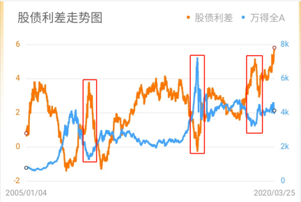

# 股债利差

股债利差出自美联储的相关研究，美联储证明过去多年数据，发现股票投资收益率与美国长期国债收益率之间存在显著的相关性。

【股债利差】可以简单的理解为股票的收益比国债高多少。

如果股票每年收益10%，10年期国债利率3%，

股债利差 = 7%

那大家都会去买股票。

反过来，如果股票每年收益只有2%，10年期国债利率3%，

股债利差 = -1%

那没人会买股票，全买国债。

所以当差值越大的时候，说明股票比国债收益更高，股票越值得买。

从上图，我们可以非常清晰地看到：

股债利差的数值与整体市场的走势有着非常明显的负相关关系，非常有力地印证了【股债利差越大，股票越值得买】的结论。

如果我们进一步计算出历史上每个交易日的股债利差值，然后和历史上的时间比，算出比历史上百分之多少的时间都大，就可以很好地判断市场的估值。

比如，如果股债利差比历史上90%的时间都大，那就是股市非常便宜，非常值得买入的时机。

## 计算方式

具体就是【股票的收益率】-【国债收益率】。

https://www.bilibili.com/video/BV1gA411T7M7

