# 宽基指数 PE 值

操作办法

1. 将跟踪的指数 PE 图画出来
2. 标记处 E 大购买的点位，统计出当时的估值
3. 标记处 E 大卖出的点位，统计出当时的估值
4. 设计出估值操作区间

## 基金长投温度

### 温度原理

1. 温度高低与价格高低没有必然联系

2. 高低反映的是历史中，低于指数当前估值出现的概率

   1. 温度越低

      历史上低于当前估值的概率越小

   2. 温度越高

      历史上低于当前估值的概率越大

| 区间  | 说明         | 操作 | 仓位            | 备注 |
| ----- | ------------ | ---- | --------------- | ---- |
| >90   | 泡沫后期 | 清仓 | 20-30% | 机动仓位 |
| 50-90 | 泡沫中期 | 大卖 |                 |      |
| 40-50 | 泡沫 | 逐步卖出 |                 |      |
| 30-40 | 泡沫初期 | 持有 |                 |      |
| 20-30 | 健康 | 继续买入 |                 |      |
| 10-20 | 黄金底 | 买入良机 | 80%             |      |
| 0-10 | 钻石底 | 买入 | 80%             | 上涨空间巨大 |

每个阶段的操作，是要继续优化的

### 温度计算公式参考

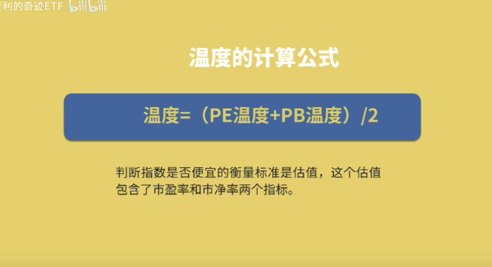

### 数据来源

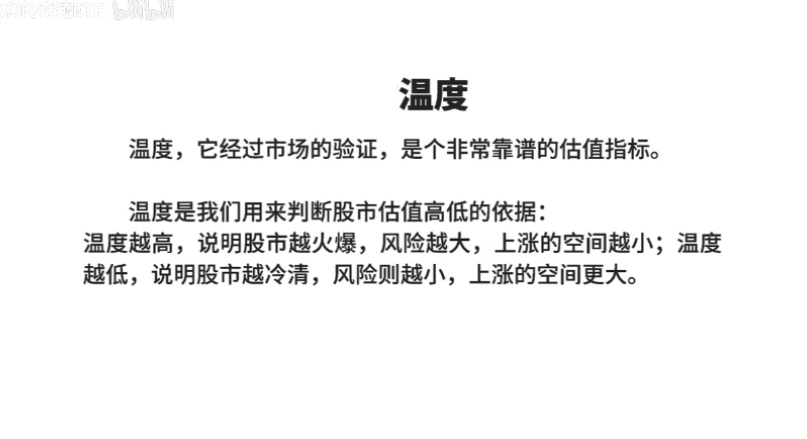

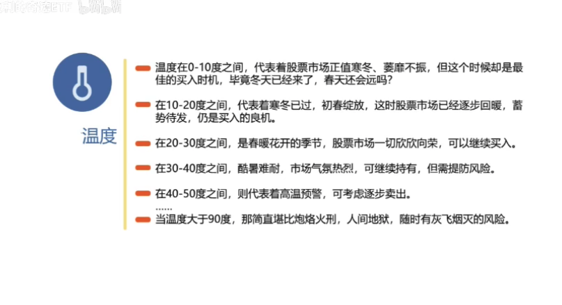

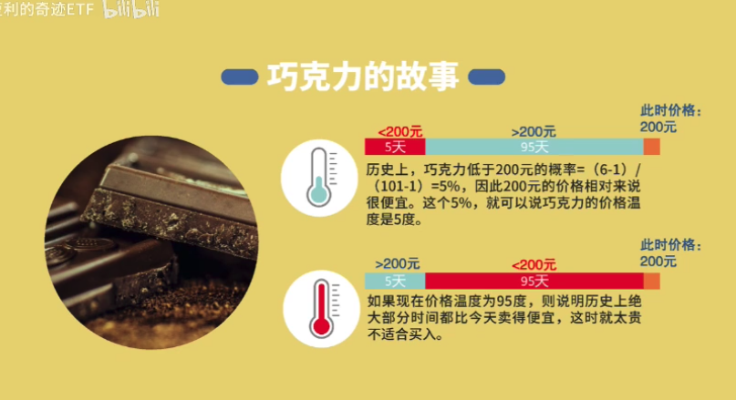

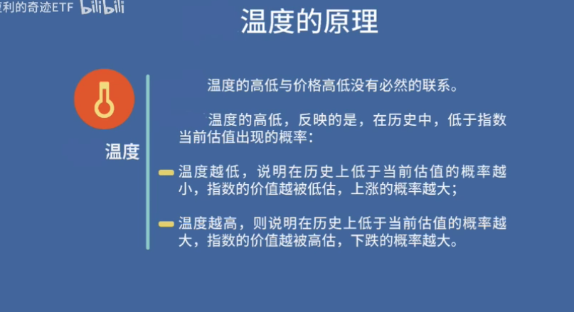

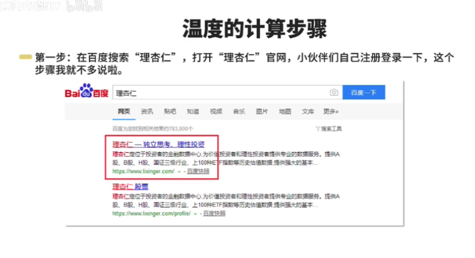

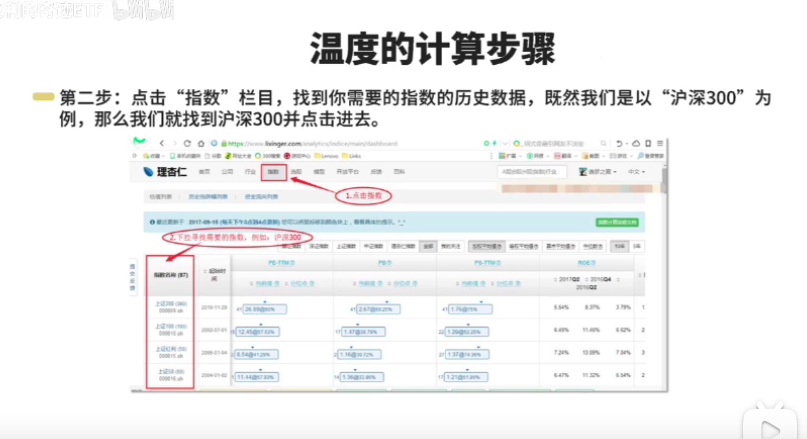

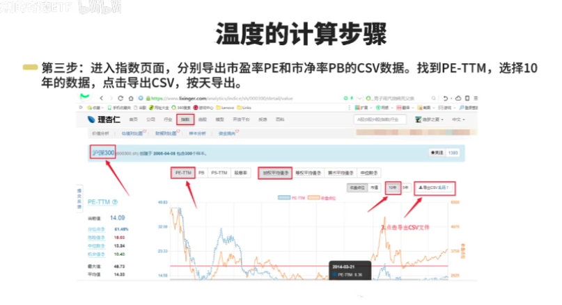

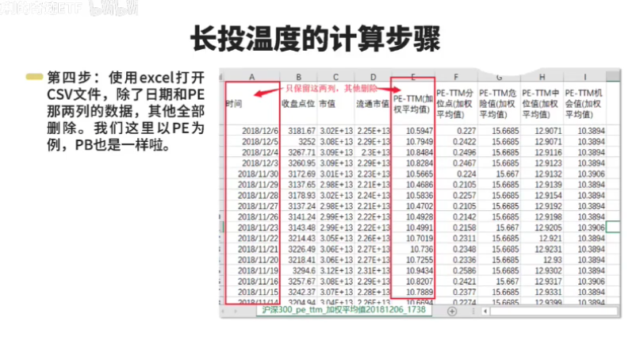

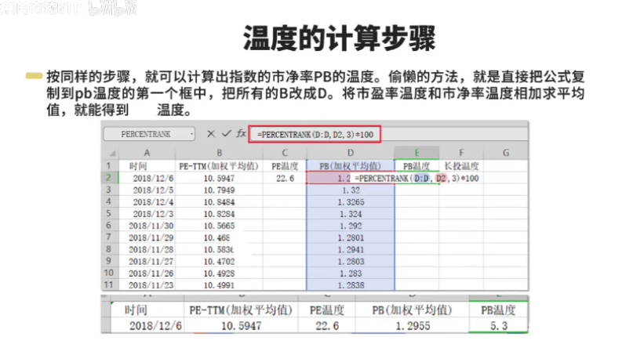

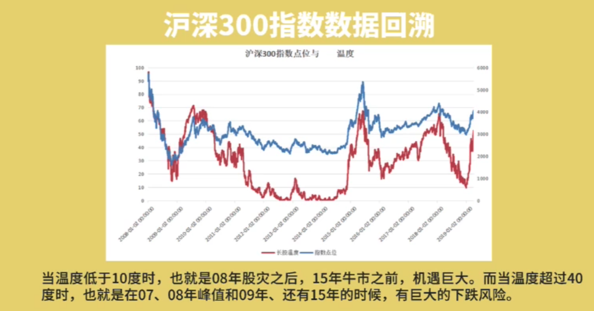

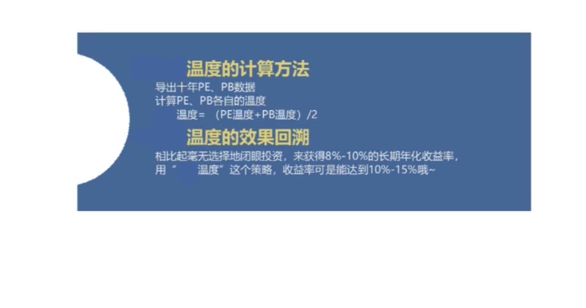