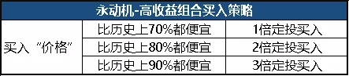

# 长期基本投资策略

## 1. 投资标的

### 只买基金

宽指基金、行业指数基金、主动基金、股债基金

### 品种挑选

这一块，会参考 E 大的 150 计划策略

## 2. 定期存钱

### 2.1 金额

不论市场行前如何，把一定的工资比例的金额存入定投账户。

先不管这笔钱是否会投出，都先存入。

以保证后续有投资需求的时候，有足够的子弹。

也是强制储蓄的一种方法。

比如每个月固定把工资10%、15%、20%投入账户。

### 2.2 无风险理财产品

将储蓄资金，购买无风险理财产品

#TODO#

这一块后续要研究的是，在大陆和加拿大，分别有哪些产品可以购买

## 3. 买入规则

### 3.2 买入频率

#### 牛市顶部区间

每月做4次判断，

留意市场变化，卖出估值极高的产品

保住收益

#### 牛市向上区间

每月做两次判断，如果有指数进入目标区间，才做交易。

否则就将新投入的资金，放入无风险的理财产品中。

购买金额，1 -2份

#### 熊市向下区间

每月做两次判断

如果有指数进入目标区间，才做交易。

否则就将新投入的资金，放入无风险的理财产品中。

购买金额，1 -2份

#### 熊市底部区间

每月做4次判断，

尽量收集资金，在底部购买筹码

### 3.1 买入依据

#### 估值区间

**根据指数估值做购买判断**

跟踪个人跟踪指数基金的情况

对于指数基金，要根据追踪投机的长投温度，来判断

#### 价格区间

****

##  4. 卖出规则

### 4.1 卖出止盈规则

我们的具体卖出止盈规则为：

****

### 4.2 卖出止损规则

## 5. 规则优化思路

这是我自己的定投策略，不是网上某某人的策略，这个是一定要想清楚的。

一旦确定了， 就会开始执行。

### 5.1 优化点

- 买入策略
- 卖出策略
- 资金分配

### 5.2 优化的目标

- 收益率会更高
- 回撤会更小

通过阅读 E 大的笔记，来长期优化自己的定投策略

