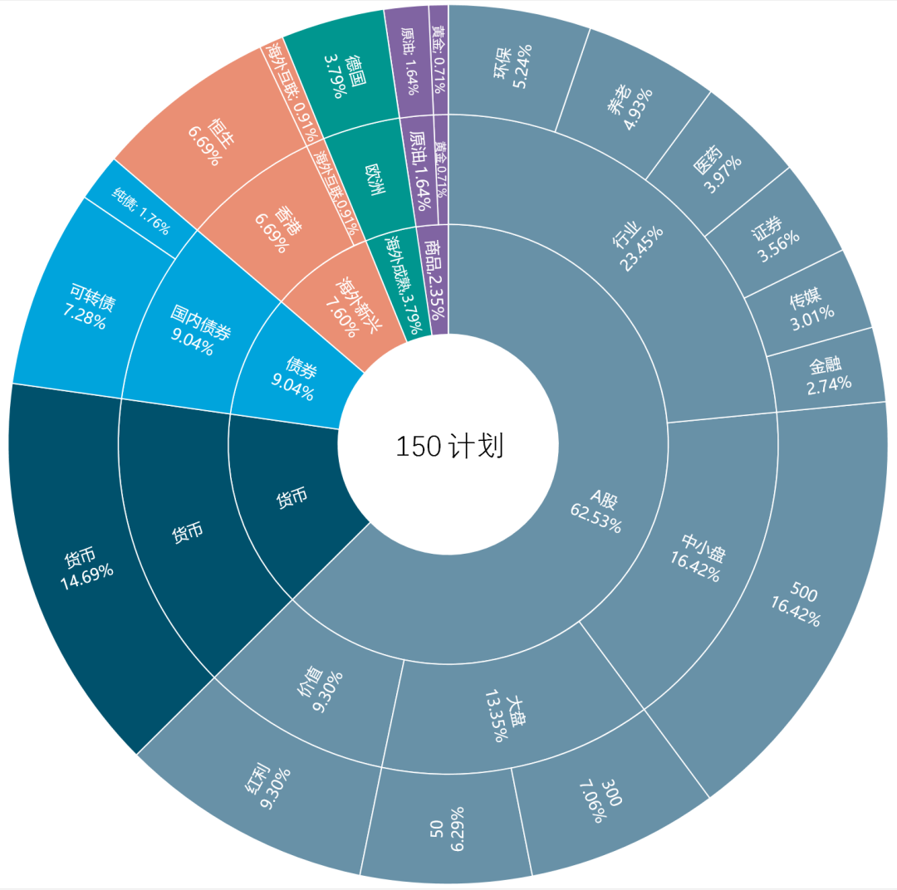

# 资产配置

| 品类   | 25 岁 | 35-45 岁 | 55 岁 | 65 岁+ |
| ------ | ----- | -------- | ----- | ------ |
| 股票   | 70%   | 65%      | 55%   | 40%    |
| 债券   | 15%   | 20%      | 27.5% | 35%    |
| 房地产 | 10%   | 10%      | 12.5% | 15%    |
| 现金   | 5%    | 5%       | 5%    | 10%    |
|        |       |          |       |        |
|        |       |          |       |        |
|        |       |          |       |        |
|        |       |          |       |        |
|        |       |          |       |        |

### 2. 各类资产的特点

|      | 优点                                          | 缺点                                                         | 备注                                 |
| ---- | --------------------------------------------- | ------------------------------------------------------------ | ------------------------------------ |
| 股票 | 赚钱多                                        |                                                              | 股票进场时机不重要，关键在于持续投资 |
| 债卷 | 主要是避险，可以抵消通货膨胀。 手里的钱不会毛 |                                                              |                                      |
| 房产 | 在成熟市场中，主要是为了分散风险              | 很难赚钱。问题在于：地税、后期维护、如果出租，房客会有突发情况 |                                      |
|      |                                               |                                                              |                                      |
|      |                                               |                                                              |                                      |
|      |                                               |                                                              |                                      |
|      |                                               |                                                              |                                      |
|      |                                               |                                                              |                                      |
|      |                                               |                                                              |                                      |

## 3. 资产配置

如果你注意到我们每次发车文章的这张图，你就会懂：

注意这张图从内开始

#### 第二圈的类别

分别是：

- A股、
- 货币、
- 债券、
- 海外新兴市场股票、
- 海外成熟市场股票、
- 商品。

#### 第三圈更加细分

在以上大类中，再次细分为：

- A股价值股、
- A股大盘股、
- A股中小盘股、
- A股行业股、
- 国内债券、
- 海外债券、
- 港股、
- 海外互联、
- 欧洲、
- 美国、
- 原油、
- 黄金。

第四层则分得更细。

这，就是资产配置。

