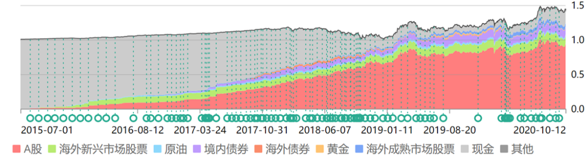

# v2.0 动态股债动态平衡

## 什么是动态股债动态平衡

1. 动态股债，股票：债券的比例，不再是固定的
2. 动态平衡，调整两者比例的时机，不再是固定的

所以称之为动态股债动态平衡。

### 1. 股票：债券的比例，不再是固定的

你有没有发现我们的150计划仓位是不断变化的。

2015年7月，股灾前最高点时，我们的现金仓位几乎占了100%，A股基本没有。

之后，随着市场不断下跌，我们的权益类资产占比越来越大，最终在2018年钻石坑前附近大幅提升。

一直到现在，没有再发生大的变化。

这就是“动态”平衡。

这时，不再将债券与A股的比例固定。

而是根据市场估值状态动态调整。

在低风险配置概念中，我建议你将债券的波动范围设置在70%-95%，股票的波动范围设置在5%-30%。

如果你愿意提升风险容忍度，获取更高的收益率，可以加大股票仓位波动范围。

第一层的固定比例也是如此，可以设置80：20或者75：25等。

动态平衡后，风险并未大幅增加，依然可以做到除了2013年外每年盈利，但年化收益率已经可以提升到超过7%。

写着写着发现已经太多了，一次写不完，我们就下次继续说吧。

再说一次，资产配置是由浅入深，循序渐进。

从固定比例到动态比例，到后面操作难度和收益率加大、也更加有趣的配置方式，相信至少会给你一些启发，完善自己的系统。

有人说，搞这么复杂干嘛，我直接买个配置基金不行吗？

不行。

你以前不会，现在不会，以后也绝对不会把所有资金买入一只/一类品种。

只要你手上还有钱，那你就需要“资产配置”的理念。

当你在熊市低位，看着手里那只配置基金浮亏30%却不得不拿钱出来买房/结婚/治病/孩子上学的时候，你才会知道资产配置的重要性。

即使你那只配置基金之后在牛市中赚了70%，也与你无关了。

因为，熊市中急用钱的你，把它亏损卖掉了。

除非你穷困一生，永远没有闲钱进行金融投资。

不然的话，资产配置是你必须上的一节必修课。

我愿意与你分享我十几年配置经验的一些心得，希望你喜欢，更希望对你有用。

下次接着说。

## 资产配置

资产配置的艺术，并不完全等同于仓位控制。

资产配置，是要根据科学合理的计算，辅之以经验与意识的艺术，将你或多或少的资金，配置在此消彼长的各类资产中。经过不断的动态平衡，在某类资产暴跌的过程中，你也能取得总资产的增长。

## **叁：关于仓位**

这里说两句貌似有点跑题的。

投资经验不是那么足够的朋友，总是有一个疑问：

> 现在到底应该有多少仓位？

我想说，这个问题对1000个人来说，也许有957种答案。

每个人的资金量、预期收益、风险承受能力、性格完全不同。

这就导致了，能够回答这个问题的，只有你自己。

### 首先，你要问自己几个问题：

如果我手上的股票或者指数，跌了40%，我会不会痛苦？

如果我手上的股票或者指数，涨了40%，我会不会难过？

**你的股票跌了，你会痛苦，就说明你的仓位重了；**

**反之，你的股票涨了，你痛苦，说明你仓位太轻。**

好了，现在遵照这两个问题答案，把你的仓位调整到最平衡的位置：

也就是说，涨40%和跌40%的时候，都不是那么难过。

这时候，就合适了。

有朋友说了，这什么东西？我来炒股你先问我舒服不舒服？

我要说，答对了，朋友。

投资，你首先心里要舒服。

你不舒服，你慌乱，你兴奋或者痛苦，就很容易犯大错。

面对涨跌，谈笑风生，不仅来自于洞悉一切的高度，也来自于你的持仓。

对很多看不懂市场的朋友来说，仓位则更加重要。

停止患得患失，真正地面对自己、认识自己、了解自己，然后调整你的仓位。

但无论如何，本人的建议是，

> 不要轻易空仓或者满仓，不要赌博。

