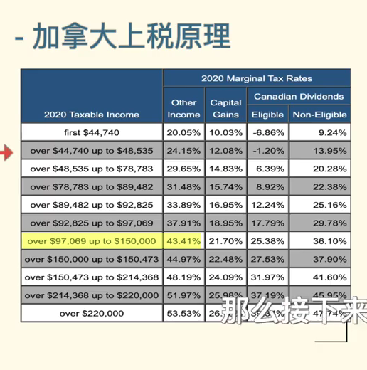

# RRSP

## RRSP 优点

RRSP 的投资，直接在年收入中减去。降低当年的税率。目标就是降低税阶

等退休的时候，收入降低很多，到时候把钱从 RRSP 中取出来，即使上税，也在低税率阶段里

- RRSP 中的投资，收益不上税
- 债权人保护

## 额度

- 每年收入的 18% ， 但不能大于一个数量，$27230
- 金额可以累积

个人的额度，可以分配给配偶

可以交在没有收入的人账户。

比如存在我老婆账户。

这样可以分摊未来交税

#### 查询额度

1. 查看 notice of assessment
2. 登录 cra 官网
3. cra 客服 800-959-8281 先按 3，再按 1

## 交税

RRSP

所有收益，都必须交税，不是 50%。

普通投资亏损，可以抵税

## 免税取出

1. 第一次买房
2. 学习读书

## 常见问题

#### - 新年 RESP 额度起点

新年的第 61 天开始，一般是新年的3 月 1 日前后

注册退休储蓄计划RRSP的全称Registered Retirement Savings Plan，是由纳税人建立，通过政府注册，由纳税人或者纳税人及其配偶推动的退休储蓄计划。注册此计划可以在报税时享受税务优惠。其中获得的任何收益在计划中是免税的，只有在取出时要依法纳税。

此税务优惠仅针对有工作收入（Earned Income）的人，这里的工作收入包括：受雇所得、自雇所得、赡养费、净租金收益等。

收入不包括：投资所得比如利息、股息和资本利得、养老金（OAS）、RRSP或加拿大退休、抚恤金、养老金（QPP）所产生的收入等。

**政策优惠**

- 降低收入,降低税率

在规定配额之内的RRSP储蓄可以降低其应纳税的收入，每年都可以减免你所需要上缴的一定税额，从而达到降低税率的目的。RRSP作为一种有效的收入调整工具，可以在纳税人财税规划中起到很好的作用。

- 投资延税复利增长,达到投资最佳效果

RRSP账户中的投资盈利不需在当年纳税，从而可以实现延税复利增长达到最好的投资回报，直到退休养老时将RRSP账户内资金取出时才需纳税。

**如何开户**

**找谁买，何时买**

可以通过各种金融机构去开设RRSP账户，这些金融机构可以是：

- 银行
- 人寿保险公司
- 信托公司
- 信用合作社

注：你可以拥有超过一个的RRSP账户

你可以同时在银行、信用社和保险公司拥有RRSP账户。也可以更改和转移 RRSP 开户公司到另一家。

**可投资项目**

RRSP不只可以作为简单的储蓄账户，该帐户投资范围广阔，主要包括：

低风险：储蓄户口、定期存款、政府债券、货币市场基金等;

中等风险：互惠基金和保本基金等;

高风险：如股票市场。

**额度计算**

**RRSP的额度计算方法**

- 纳税人去年赚取的收入（Earned Income）所带来每年新的额度

政府规定是上一年收入的18%。但是政府也规定了最高限额，这个最高限额是政府随着通货膨胀的变化每年给出不同的数字，2017年的最高限额是$26,010，2018年的是$26,230。

- 过去未使用的供款限额（Unused Contribution Room Carry Forward）

如果当年的供款限额没有使用或者没有使用完，可以转移到以后的年度。

注：

- 最迟可给自己供款的年度为纳税人到达71周岁的那年。
- 如果超过供款限额（OVER CONTRIBUTION）的话， 一个纳税人可以有2,000的超限额供款，超过2,000的部分必须罚款（每月1%的罚款率）。

**计算RRSP额度**

你不用刻意去计算你有多少的累计额度可以供款，政府提供了很方便的手段让你来查询你的额度。你可以通过以下方法进行查询：

- 查阅上一年税务局发的报税评定通知书（Income Tax Notice of Assessment）或者再评定书（Notice of Reassessment）。在通知书上的Amount (A) of the RRSP Deduction Limit Statement。
- 打电话到税务局Tax Information Phone Service (TIPS)热线1-800-267-6999。服务时期是每年9月中旬到第二年的4月30日。
- 使用最新的MyCRA的手机智能程序。
- 使用税务局网站My Account的服务。第一次使用需要先注册申请加拿大政府的epass，得到政府给的激活密码后才可正常使用。

**取款使用**

很多人误以为RRSP存款在需要用钱的时候不能随时取出来，只有到退休后才能提取。实际上，RRSP存款是你的个人资产，你可以随时取出来使用，政府没有任何限制，只是该取款额度需并入当年收入计税。只有在符合有关规定的情况下，提款才可以不需纳税，比如：首次购房计划(HBP)和终生学习计划(LLP)等。

**首次购房计划 HBP**

加拿大政府为了鼓励首次购房者，特设立了HBP计划。该计划允许每人从自己的RRSP中取出最多2万元(夫妇可共取出4万元)用于购买合格的首次自住房。

- 首次自住房：过去5年从来没有过一个主要居住房。对已婚者夫妇双方均要符合这一点。
- 合格自住房：计划在买好或造好房子的一年内作为主要居住房且房子必须在加拿大境内。入住后并没有要求购房者至少要住多长时间。
- RRSP必须存够90天才能用于HBP，否则需要交税。取出RRSP时须填写T1036表。
- 取出RRSP后必须在下一年度的10月1日前购房。
- 如果购房前没有取出RRSP而想利用HBP，则购房30天之内必须取出RRSP。
- 如果以前参加过HBP，在你计划从RRSP取款那一年的1月1日，必须还清所有以前的借款。
- 从取款后的第二年算起。取出的RRSP必须在15年内还清。每年至少还1/15。还款不视为新的RRSP供款，因而也不可用于减税。多还无妨。如少于1/15，少还部分视为当年收入。还款不一定还到原来取款的机构。还款于任何自己的RRSP帐户均可。
- 如果没有买房或建房而需要取消计划，则须填写取消表格并在取款次年的12月31日前退换所有取出的款项。

**终生学习计划 LLP**

终生学习计划 Lifelong Learning Plan，简称 LLP， 始于1999年。纳税人可以从RRSP中取款来资助自己或配偶读书，取出的款不计入当年收入，因而也不用纳税，该计划具有以下特点：

- 参加LLP计划须满足以下条件：A. 71周岁以下拥有RRSP的加拿大居民。B. 作为全职学生已参加指定教育机构合格的项目(或收到下一年度三月之前入学的通知书)
- 取款时须填写RC96表格。
- 取款额度每年最多$10，000，总额不超过$20，000。
- LLP学生必须：A. LLP取款后三月份之前必须注册入学。B. LLP取款后四月份必须是注册的学生(除非已经完成该项目学习)
- 取款额须在10年之内返还。每年还款额不少于1/10。
- LLP取款后四月份之前退学，如果学校返还学费少于所交学费的75%，你可以在10年之内返还取款额。否则，你需要填写取消LLP表并在当年12月31日前返还取款额。

**RRSP转换成RRIF**

在RRSP持有人到达71岁时，RRSP帐户必须关闭。按规定RRSP持有人到时可选择提取现金或将其转入RRIF(RRSP转成RRIF最低年龄为55岁)。如提取现金将面临当年支付大额税款的境况，故大多数人会选择将RRSP转入RRIF，持有人不必马上纳税。根据有关规定，从RRSP转换成RRIF的下一年度起，帐户所有人每年须按比例从RRIF中提款，此款项按当时收入计税。