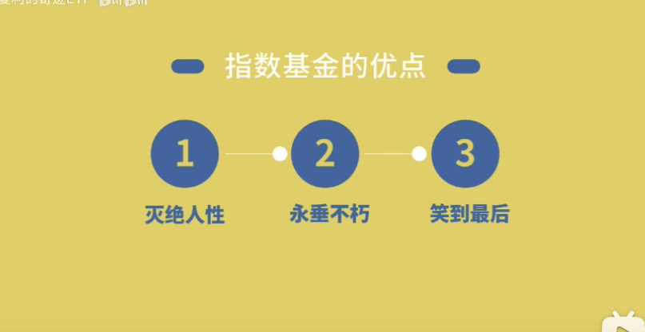

## 1. 基金种类

---

1. 按投资品种分
    1. 货币基金
    2. 债卷基金
    3. 股票基金
    4. 混合基金
2. 按交易渠道分
    1. 场内
    2. 场外
3. 按运作方式分
    1. 开放
    2. 封闭
4. 按投资方式分
    1. 主动，自由选股
    2. 被动，按照指数购买

- 股票型基金：

投资80%以上的钱去买股票，追求高收益和风险

- 指数型基金：

持有很多大盘和行业的股票，追踪大盘和行业的走势，上证指数和沪深300就是大盘，沪深300指数就是跟踪沪深市值和流动性强300的股票走势，其他同理，中收益中风险

- 混合型基金

基金经理自己控制股票、债券、存款的比例，以达到控制风险的目的，追求**高收益中风险**

没有限制性的的比例

- 债券型基金：

购买国债企业债金融债，收取利息，收益稳定风险较低

收益 5-6%

用以规避风险

- 货币基金

安全，收益低

2-3% 收益

- 基金风险：

从高到低依次为

股票 > 混合 > **指数 > 债券** > 货币

### 1.2 按照交易渠道分

场内基金，买家之间交易

场外，买家和基金公司交易

关键是交易价格，场外是以当天下午3点休市时的价格结算

### 1.3 按照交易渠道分

开放和封闭是指基金份额是否变化，

封闭式基金，份额不变

### 1.3 按照投资方式分

### 1.4 其他基金性质：

- LOF基金：   开放式基金，随时可以买入或卖出
- FOF基金：   投资基金的基金
- QDII基金：  投资海外股市的基金
- 基金后面带A：  适合长期投资，短期买出费用较高
- C类基金：           适合短期投资，长期外出费用较高

## 2. 怎么读基金招募书

[基金公告](http://fund.eastmoney.com/gonggao/110022,AN202010201422467448.html)

基金公司是否靠谱

基金经理是否靠谱

- 从业时间
- 学术背景
- 历史业绩
- 获奖情况

新基金：

新基金请参考基金经理过往业绩表现，投资方向一般三个月内无法卖出，并只在周五更新一周的涨幅，新基金不可能100%保证盈利，一般新基金在对应基金公司APP里面申购手续费会比较低，新基金发售可在天天基金网里面新基发售板块找到

## 3. 基金选择

### 3.1 选货币基金

### 3.2 选债券基金

基金规模 5-100 亿比较好

### 3.3 选混合型基金

### 3.4 选股票基金

要强化去看熊市的表现

## 4. 指数基金

### 4.1 基本概念

比较牛

- 红利指数
- 中证 500

行业指数基金的波动更大

---

### 4.3 指数基金的购买

### 基金净值

就是一个基金值多少钱，

### 累计净值

就是成立到现在的价格，

支付宝每天晚上8:00之后更新净值，

每个交易日9:30到下午3:00来回浮动估值。

基金建议操作时间下午

2:30~3:00，下午3:00之前买入和卖出，按当天价格计算，下午3:00之后买入和卖出，按明天价格结算。

卖出基金一般两天返回余额宝，QDII基金时间较长，我们可以根据当前估值进行加仓或减仓，但是估值和净值会因基金经理操作形成差异，周日和法定节假日股市不开盘，基金不更新。

支付宝选择财富选择基金，可以搜索推荐排行榜、基金财富号，选择基金。

买入费率：

C类基金一般为零，每年收取2%左右的管理费、托管费、销售服务费，7天内卖出手续费1.5%，30天内卖出手续费0.5%，30天以上卖出不收手续费。

A类基金买入手续费为0.12%～1.5%，每年收取共1.5%左右的管理费托管费，7天内卖出手续费1.5%，30天内卖出手续费0.75%，半年内收0.5%，一年内收0.25%，一年以上不收费

基金买入和卖出费率各有不同，具体收费请参考支付宝基金收费规则。

**波动率**

查看基金风险，波动率是一个不错的指标，波动率指的是基金净值的波动率。波动率大的基金风险也更高，玩的就是心跳。

**最大回撤**

这也是一个抗风险能力指标。回撤的意思，是基金从最高点跌到最低点的幅度。回撤大的基金抗风险能力也比较差。

**夏普率**

承担相同程度的风险，创造的收益越高，夏普比率越高。这个指标在机构很常用，也经常被用来衡量程序化模型。记住一点，夏普比率越高越好。