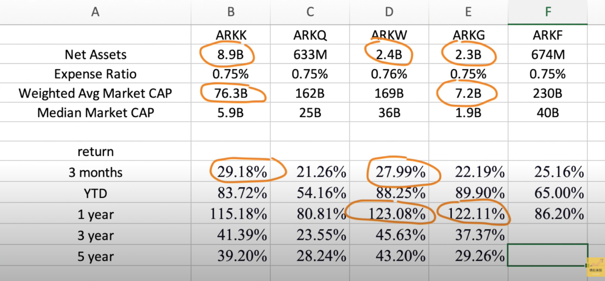

# ARK Invest方舟投资

https://ark-funds.com

TODO

1. 在questrade 能不能买 ARK
2. 现在的价格怎么样，适不适合长期定投

## 1. CEO 凯瑟琳-伍德

凯瑟琳-伍德（Catherine Wood）女士，美国金融分析师及企业家，现任ARK Invest（方舟投资）行政总裁及投资总裁.

以投资破坏性创新科技公司及其基金的高回报获得广泛关注，有「科技股女股神」的外号。

## 2. 旗基金

ARK Invest（方舟投资）公司旗下有五支主动管理ETF，分别是：

- [ARKK](https://ark-funds.com/wp-content/fundsiteliterature/holdings/ARK_INNOVATION_ETF_ARKK_HOLDINGS.pdf) 

  ARK Innovation ETF 投资跨行业的创新型公司
- [ARKQ](https://ark-funds.com/wp-content/fundsiteliterature/holdings/ARK_AUTONOMOUS_TECHNOLOGY_&_ROBOTICS_ETF_ARKQ_HOLDINGS.pdf) 
ARK Autonomous Tech. & Robotics ETF 投资机器人技术，自动驾驶汽车，能源存储，3D打印和太空探索领域的创新型公司
- [ARKW](https://ark-funds.com/wp-content/fundsiteliterature/holdings/ARK_NEXT_GENERATION_INTERNET_ETF_ARKW_HOLDINGS.pdf) 
ARK Next Generation Internet ETF 投资云计算，大数据，数字媒体，电子商务，区块链技术和物联网领域的创新型公司

- ARKG
Genomic Revolution ETF 投资基因治疗，分子医疗和制药领域的创新型公司

- ARKF

  Fintech Innovation ETF投资金融科技领域的创新型公司

由于这些ETF的业绩非常出色，并且会公布每日持仓，短线散户颇为喜欢观察其持仓和操作。凯瑟琳也常被这些粉丝称为女神。

### 2.1. [ARKK](https://ark-funds.com/wp-content/fundsiteliterature/holdings/ARK_INNOVATION_ETF_ARKK_HOLDINGS.pdf) 

## 3. 购买方式

## 5. 跟踪工具

https://ark.alien-tomato.com/

https://www.arktrack.com/