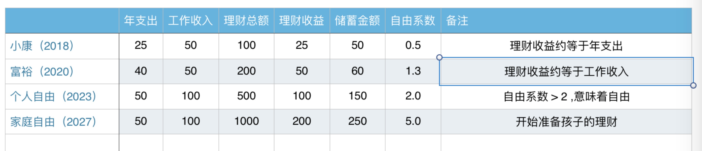

# 财务自由-分阶段目标

| 品类   | 25 岁 | 35-45 岁 | 55 岁 | 65 岁+ |
| ------ | ----- | -------- | ----- | ------ |
| 股票   | 70%   | 65%      | 55%   | 40%    |
| 债券   | 15%   | 20%      | 27.5% | 35%    |
| 房地产 | 10%   | 10%      | 12.5% | 15%    |
| 现金   | 5%    | 5%       | 5%    | 10%    |

|      | 目标            | 年份    | 备注                                                    |
| ---- | --------------- | ------- | ------------------------------------------------------- |
| 1    | 500 万现金资产  | 2026 年 | 20-30 年，如果可以做到20%回报，2026 年可以做到 500 万。 |
| 2    | 500 万现金资产  | 2030 年 | 争取做到 10% 的年回报，                                 |
| 3    | 1000 万现金资产 | 2035 年 | 55 岁退休                                               |
|      |                 |         |                                                         |

## 人生分配

| 年龄段 |   生活状态   | 城市   | 收入来源 | 目标                               |      | 备注 |
| ------ | :----------: | ------ | -------- | ---------------------------------- | ---- | ---- |
| 40-50  | 工作，拼拼拼 | 多伦多 | 工作     | 目标：攒 500 万，研究学习理财技巧  |      |      |
| 50-60  |    半工作    | 杭州   | 工作     | 500w的（理财收入+ 本金）+ 工作收入 |      |      |
| 60-65  |     旅行     | 杭州   | 退休金   |                                    |      |      |
| 65-70  |     退休     | 杭州   | 退休金   |                                    |      |      |
| 70+    |              |        |          |                                    |      |      |

